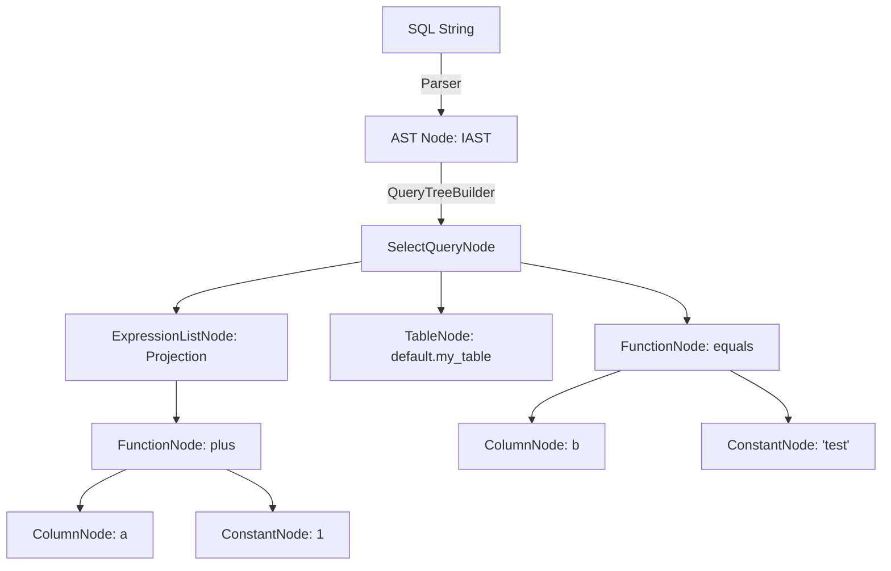
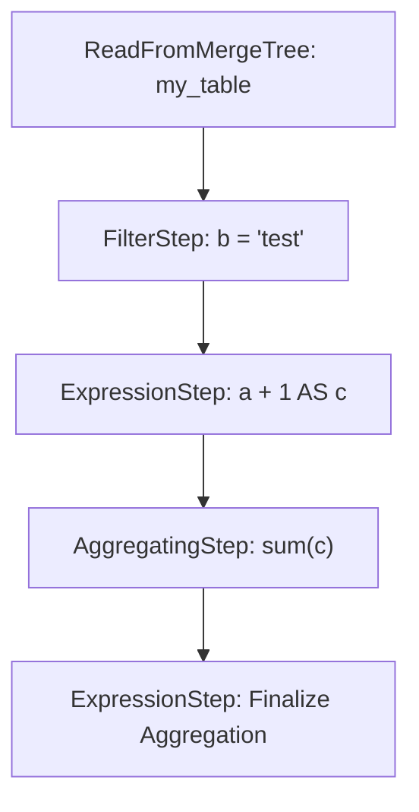
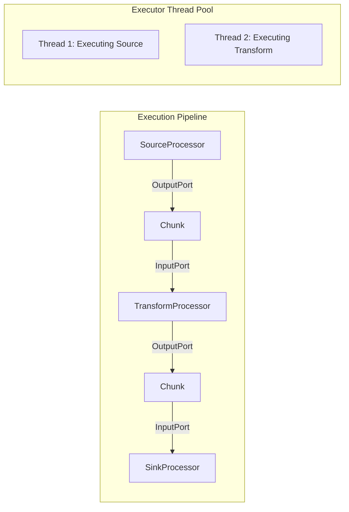

# ClickHouse New Analyzer and Processor Execution Engine: Deep Dive

This comprehensive technical guide explores ClickHouse's New Analyzer (often referred to as Query Pipeline 2.0 at the logical level) and its modern Processors Execution Engine. It covers the complete lifecycle of a query from the Abstract Syntax Tree (AST) to the multi-threaded execution pipeline.

## 1. QueryTreeNode Architecture

The "New Analyzer" in ClickHouse is a complete rewrite of the logical query planning phase. Previously, ClickHouse performed transformations directly on the AST or during the execution pipeline setup. The new architecture introduces a formal logical representation called the **QueryTree**.

### AST to QueryTreeNode Conversion

The journey begins when the parser generates an AST (`IAST`). The `QueryTreeBuilder` (located at `src/Analyzer/QueryTreeBuilder.h/cpp`) is responsible for converting the raw AST into a strongly-typed `QueryTreeNode` graph. 

The base interface for all nodes is `IQueryTreeNode` (`src/Analyzer/IQueryTreeNode.h`). Unlike the generic AST, QueryTree nodes are semantically aware and carry type and scope information.

### Core QueryTreeNode Types

Key node types (found under `src/Analyzer/`) include:

*   **`SelectQueryNode`**: Represents a complete `SELECT` query block, containing references to its projection, `FROM` clause, `WHERE`, `GROUP BY`, etc.
*   **`TableNode`**: Represents a concrete table source in the `FROM` clause. It binds to the actual `StoragePtr`.
*   **`ExpressionListNode`** (often `ExpressionListQueryNode`): A container node for a list of expressions, such as the select list or `ORDER BY` items.
*   **`FunctionNode`**: Represents an ordinary function, aggregate function, or window function invocation. It holds arguments and the resolved function signature.
*   **`ConstantNode`**: Represents literal values with their explicitly resolved ClickHouse `DataType`.

### Mermaid Diagram: AST to Query Tree



## 2. QueryTreePassManager & Optimization Passes

Once the QueryTree is constructed, ClickHouse applies a series of logical optimizations. This is orchestrated by the `QueryTreePassManager` (`src/Analyzer/Passes/QueryTreePassManager.h`).

Passes traverse the QueryTree (usually bottom-up) and mutate it, returning a new or modified node. 

### Key Optimization Passes

All passes are generally located in `src/Analyzer/Passes/`.

1.  **`ExpressionAnalysisPass`**: Resolves types for expressions, performs constant folding, and ensures type safety.
2.  **`ColumnPruningPass`**: Analyzes which columns are actually required for the final result and pushes this requirement down to the `TableNode` to minimize I/O.
3.  **`QueryTreePruningPass`**: Removes redundant branches or expressions (e.g., a `WHERE 1 = 1` or an unused subquery).
4.  **`AggregateFunctionOptimizationPass`**: Rewrites aggregate functions to more optimal variants (e.g., `count(1)` to `count()`, or `sum(distinct x)` to a faster combinator if applicable).
5.  **`JoinPass`**: Analyzes `JOIN` conditions, determines join algorithms, and optimizes join trees (e.g., outer to inner join conversion based on filters).

```cpp
// Example conceptual workflow of pass manager
QueryTreePassManager manager;
manager.addPass(std::make_unique<ExpressionAnalysisPass>());
manager.addPass(std::make_unique<ColumnPruningPass>());
manager.addPass(std::make_unique<JoinPass>());
// Run passes sequentially
manager.run(query_tree_node);
```

## 3. QueryPlan & QueryPlanStep

After logical optimization, the `QueryTree` is translated into a **`QueryPlan`** (`src/Processors/QueryPlan/QueryPlan.h`). The QueryPlan is a Directed Acyclic Graph (DAG) of **`IQueryPlanStep`** objects. This is the physical planning phase.

### QueryPlanStep Types

Steps are defined in `src/Processors/QueryPlan/Steps/`:

*   **`ReadFromMergeTree`**: A specialized step for reading from the MergeTree family of engines. It handles primary key index analysis and parts selection.
*   **`FilterStep`**: Applies a boolean expression to filter rows.
*   **`ExpressionStep`**: Evaluates functions and aliases, adding or mutating columns.
*   **`AggregatingStep`**: Performs `GROUP BY` aggregations.
*   **`UnionStep`**: Merges multiple streams together (e.g., for `UNION ALL`).

### Mermaid Diagram: Query Plan



## 4. Processors Execution Engine

The final phase converts the `QueryPlan` into an executable pipeline graph. ClickHouse's execution engine is built around **Processors** (`src/Processors/`).

### Core Concepts

*   **`IProcessor`** (`src/Processors/IProcessor.h`): The fundamental unit of execution. A processor has inputs and outputs.
*   **`InputPort` / `OutputPort`** (`src/Processors/Port.h`): Processors are connected via ports. Data (in the form of `Chunk`s) flows from an `OutputPort` of one processor to an `InputPort` of another.
*   **`ExecutingGraph`**: The directed graph representing the physical pipeline of connected processors.
*   **`PipelineExecutor`** (`src/Processors/Executors/PipelineExecutor.h`): The scheduler that runs the graph.

### State Machine (Push/Pull)

Processors do not "call" each other. Instead, they run a state machine driven by the `PipelineExecutor`. An `IProcessor` must implement the `prepare()` and `work()` methods.

The port states control the execution flow:
*   **`NeedData`**: An InputPort is empty and waiting for a chunk.
*   **`PortFull`**: An OutputPort has a chunk waiting to be pushed down the pipeline.
*   **`Ready`**: The processor has all inputs/outputs in a state where it can execute CPU-bound work.
*   **`Finished`**: The processor is done.

### Multi-threaded Work-Stealing Scheduler

The `PipelineExecutor` uses a highly optimized thread pool.
1. Threads pull `Ready` processors from a task queue.
2. The thread executes the `work()` method of the processor.
3. Upon completion, it updates port states (e.g., pushing data to the downstream processor's InputPort).
4. If downstream or upstream processors become `Ready` due to this state change, they are pushed to the task queue.
5. Threads use **work-stealing** to balance load across cores dynamically, preventing slow processors from stalling the query.

### Mermaid Diagram: Processor Pipeline



## Summary

The modern ClickHouse query pipeline is a masterclass in separation of concerns and high-performance design:
1. **AST** (Syntax) ->
2. **QueryTree** (Logical semantics, Pass optimizations) ->
3. **QueryPlan** (Physical relational algebra steps) ->
4. **Processors** (Multi-threaded, lock-free, data-driven execution graph).