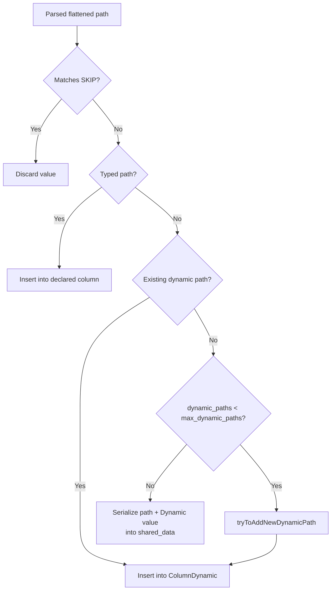

## Tuple


## Array


## Map


## Variant


## Dynamic
Dynamic is a new semi-structured data column type.
It stores dynamically typed data, allowing values with different underlying types to coexist in a single column. For example:
```
SELECT CAST(1 AS Dynamic), CAST('abc' AS Dynamic), CAST([1,2] AS Dynamic);
```
### 1. Storage Model Overview

Unlike the traditional `Variant` type:

- `Variant` is a statically defined polymorphic type with a fixed set of types.

- `Dynamic` is an extensible polymorphic type whose set of types grows automatically at runtime.

Both rely on `ColumnVariant` internally, but `Dynamic` adds a self-describing dynamic management layer on top.

The source code shows that the `ColumnDynamic` storage structure is effectively a `ColumnVariant` plus a metadata layer.
```
// simplified view:
class ColumnDynamic {
    ...
    WrappedPtr variant_column;      // Actual data storage: ColumnVariant
    ColumnVariant* variant_column_ptr; // Direct pointer retained for performance
    VariantInfo variant_info;       // Type information for all current Dynamic variants
    ...
}
```
### 2. Internal Structure (Memory Layer)

At its core, `Dynamic` is an extensible `Variant`. Each type that actually occurs (`Int32`, `String`, `Array`, `Map`, etc.) is stored in a subcolumn, while a discriminator (type identifier) records the type of each row.
| Layer         | Object                               | Description                                                           |
| ---------- | -------------------------------- | ------------------------------------------------------------ |
| **Top-level column**  | `ColumnDynamic`                  | Exposed as a regular column                                                    |
| **Internal variant column**  | `ColumnVariant`                  | Stores the data for all dynamic types                                                |
| **Variant mapping metadata** | `VariantInfo`                    | Maps each type to its discriminator (numeric ID) and type name                              |
| **Subcolumn collection**   | `ColumnVariant::columns[]`       | One subcolumn per type (`ColumnVector`, `ColumnString`, `ColumnArray`, etc.) |
| **Shared-type column**  | `SharedVariant` (`ColumnString`) | When too many types occur, values of new types are serialized into this column in binary format                                   |

Structure overview:
```
ColumnDynamic
 └── ColumnVariant
      ├── discriminator[]  ← UInt8 vector indicating the type of each row
      ├── offsets[]        ← Index offsets
      ├── variants:
      │    ├── [0]: ColumnUInt32
      │    ├── [1]: ColumnString
      │    ├── [2]: ColumnArray(UInt32)
      │    ├── [3]: ColumnMap(String, UInt32)
      │    └── [255]: ColumnString (SharedVariant)
      └── ...
```
### 3. On-Disk Storage Structure (MergeTree Layer)

In a MergeTree part, the physical layout of a `Dynamic` column is determined by its internal `ColumnVariant`.
Each variant type has a separate data stream stored using a naming convention similar to:
```
column_name.variant_<type>.<stream_suffix>
```
If the `Dynamic` values inserted into a table have three types (`UInt32`, `String`, and `Array(UInt32)`),
the resulting on-disk layout is approximately:
```
t/
 ├── dyn.variant_UInt32.bin
 ├── dyn.variant_UInt32.mrk3
 ├── dyn.variant_String.bin
 ├── dyn.variant_String.mrk3
 ├── dyn.variant_Array_UInt32.bin
 ├── dyn.variant_Array_UInt32.mrk3
 ├── dyn.discriminators.bin      ← Stores the type ID for each row
 ├── dyn.offsets.bin             ← Row offset table
 └── ...
```

### 4. Dynamic Type Expansion

When a value of a new type is inserted:

void ColumnDynamic::insert(const Field & x)


The following operations occur internally:
1. Call `x.getType()` to determine the value's type.
2. Look up the type in `variant_info.variant_name_to_discriminator`.
3. If the type already exists:
    - Write the value directly to the corresponding subcolumn.
4. If it is a new type and the limit has not been reached:
    - Call `addNewVariant()`.
    - Add a new subcolumn to `ColumnVariant`.
    - Update the `variant_info` mapping.
5. If the `max_dynamic_types` limit has been exceeded:
    - Call `insertValueIntoSharedVariant()`.
    - Serialize the value to binary and write it to `SharedVariant` (`ColumnString`).

### 5. The SharedVariant Fallback

`SharedVariant` is a fallback type:
- When there are too many types, or a type cannot be determined, new values are serialized into `SharedVariant`.
- The serialization format is `<type_name><binary_value>`.
- This ensures that a `Dynamic` column can accept values of any type.

```
insert 1 → UInt32
insert 'abc' → String
insert map('k',1) → new type Map(String,UInt32)
insert tuple(1,2) → limit exceeded → stored in SharedVariant as "Tuple(UInt32,UInt32)|<bin>"
```
### 6. Example
1. Create a table
```
CREATE TABLE default.dynamic_merge_tree_test
(
    `id` UInt64,
    `name` String,
    `dyn` Dynamic,
    `ts` DateTime DEFAULT now()
)
ENGINE = MergeTree
ORDER BY (id, ts)
SETTINGS index_granularity = 8192
```
2. Insert data
```
INSERT INTO default.dynamic_merge_tree_test (id, name, dyn)
SELECT
    number AS id,
    concat('user_', toString(number)) AS name,
    multiIf(
        (rand() % 3) = 0, CAST(toUInt32(rand() % 1000) AS Dynamic),
        (rand() % 3) = 1, CAST(concat('str_', toString(rand() % 1000)) AS Dynamic),
        CAST(arrayMap(x -> toUInt32(x % 1000), range((rand() % 5) + 1)) AS Dynamic)
    ) AS dyn
FROM numbers(1000000);
```

Inspect the files of the wide part:
```
root@ubantu64:~/work/ClickHouse/build/programs/store/a76/a7609f34-18c3-419c-a364-9f7d44d52e29/all_2_2_0# ll
total 12292
drwxr-x--- 2 root root    4096 Oct 11 18:13  ./
drwxr-x--- 5 root root    4096 Oct 11 18:13  ../
-rw-r----- 1 root root    1136 Oct 11 18:13  checksums.txt
-rw-r----- 1 root root      91 Oct 11 18:13  columns.txt
-rw-r----- 1 root root     307 Oct 11 18:13  columns_substreams.txt
-rw-r----- 1 root root       7 Oct 11 18:13  count.txt
-rw-r----- 1 root root      10 Oct 11 18:13  default_compression_codec.txt
-rw-r----- 1 root root  924507 Oct 11 18:13 'dyn.Array(UInt32).bin'
-rw-r----- 1 root root     466 Oct 11 18:13 'dyn.Array(UInt32).cmrk2'
-rw-r----- 1 root root  811132 Oct 11 18:13 'dyn.Array(UInt32).size0.bin'
-rw-r----- 1 root root     464 Oct 11 18:13 'dyn.Array(UInt32).size0.cmrk2'
-rw-r----- 1 root root       0 Oct 11 18:13  dyn.SharedVariant.bin
-rw-r----- 1 root root      56 Oct 11 18:13  dyn.SharedVariant.cmrk2
-rw-r----- 1 root root 1127869 Oct 11 18:13  dyn.String.bin
-rw-r----- 1 root root     426 Oct 11 18:13  dyn.String.cmrk2
-rw-r----- 1 root root  841164 Oct 11 18:13  dyn.UInt32.bin
-rw-r----- 1 root root     408 Oct 11 18:13  dyn.UInt32.cmrk2
-rw-r----- 1 root root      69 Oct 11 18:13  dyn.dynamic_structure.bin
-rw-r----- 1 root root      63 Oct 11 18:13  dyn.dynamic_structure.cmrk2
-rw-r----- 1 root root  565564 Oct 11 18:13  dyn.variant_discr.bin
-rw-r----- 1 root root     268 Oct 11 18:13  dyn.variant_discr.cmrk2
-rw-r----- 1 root root 4004915 Oct 11 18:13  id.bin
-rw-r----- 1 root root     415 Oct 11 18:13  id.cmrk2
-rw-r----- 1 root root       1 Oct 11 18:13  metadata_version.txt
-rw-r----- 1 root root 4188196 Oct 11 18:13  name.bin
-rw-r----- 1 root root     415 Oct 11 18:13  name.cmrk2
-rw-r----- 1 root root     177 Oct 11 18:13  primary.cidx
-rw-r----- 1 root root     229 Oct 11 18:13  serialization.json
-rw-r----- 1 root root   18042 Oct 11 18:13  ts.bin
-rw-r----- 1 root root     375 Oct 11 18:13  ts.cmrk2

```
## JSON

`JSON` is ClickHouse's native semi-structured object type. It accepts JSON objects whose paths and value types can vary between rows while still exposing paths as queryable subcolumns.

It should not be confused with:

- A `String` that happens to contain JSON text.
- The `JSONEachRow` input/output format.
- JSON extraction functions such as `JSONExtract`.
- `Dynamic`, which stores one dynamically typed value rather than an object containing many paths.

Example:

```sql
SELECT
    '{"user":{"id":42,"name":"Ada"},"score":9.5}'::JSON AS payload,
    payload.user.id,
    payload.user.name,
    payload.score,
    dynamicType(payload.score);
```

The important implementation types are:

```text
SQL type JSON
  -> DataTypeObject
  -> ColumnObject
  -> SerializationObject / SerializationJSON
```

The code uses the internal family name `Object`, but the SQL-facing schema format is `JSON`.

### 1. Storage Model Overview

A `JSON` column separates paths into three storage classes:

| Path class | Column type | How it is selected |
|---|---|---|
| Typed path | Declared type such as `UInt64` or `String` | Explicitly listed in the `JSON(...)` type declaration |
| Dynamic path | `Dynamic` | Discovered from input while the dynamic-path limit has room |
| Shared-data path | Binary-encoded dynamic value | Discovered after the dynamic-path limit is reached |

For this declaration:

```sql
payload JSON
(
    max_dynamic_paths = 2,
    max_dynamic_types = 4,
    user.id UInt64,
    user.name String,
    SKIP debug,
    SKIP REGEXP '^internal\.'
)
```

the in-memory structure is conceptually:

```text
ColumnObject(payload)
├── typed_paths
│   ├── "user.id"   -> ColumnUInt64
│   └── "user.name" -> ColumnString
├── dynamic_paths
│   ├── "event"     -> ColumnDynamic
│   └── "score"     -> ColumnDynamic
└── shared_data
    └── Array(Tuple(path String, value String))
        ├── "tags"  -> <binary Dynamic value>
        └── "extra" -> <binary Dynamic value>
```

`ColumnObject` stores typed and dynamic paths in path-to-column maps. Shared data is represented internally as an array of path/value tuples; it behaves like a per-row `Map(String, String)` whose values use the `Dynamic` binary encoding.

The paths in each row's shared-data range are sorted. This lets `ColumnObject::findPathLowerBoundInSharedData` locate one requested path without treating the row as unordered JSON text.

### 2. Typed Paths

Typed paths are declared in the column type:

```sql
CREATE TABLE json_typed
(
    id UInt64,
    payload JSON
    (
        user.id UInt64,
        user.name String,
        created_at DateTime64(3)
    )
)
ENGINE = MergeTree
ORDER BY id;
```

These paths have a stable physical and query type:

```sql
SELECT
    toTypeName(payload.user.id),
    toTypeName(payload.user.name),
    toTypeName(payload.created_at)
FROM json_typed;
```

Expected types:

```text
UInt64
String
DateTime64(3)
```

Typed paths are useful when:

- A path is queried frequently.
- Its type is known and stable.
- It is used in a primary key, data-skipping index, or materialized expression.
- Automatic inference would produce an undesirable type.

Invalid values must be converted to the declared type during parsing. A typed path trades schema flexibility for predictable storage and execution.

### 3. Skipped Paths

Paths can be omitted during parsing:

```sql
payload JSON
(
    SKIP debug,
    SKIP request.raw_body,
    SKIP REGEXP '^internal\.'
)
```

`SKIP path` ignores one flattened path. `SKIP REGEXP` ignores every matching flattened path.

Skipped paths:

- Are not stored as typed paths.
- Do not consume dynamic-path slots.
- Do not enter shared data.
- Are absent when the complete JSON value is read back.

Use `SKIP` for high-cardinality metadata, raw payload fragments, or fields that have no analytical value.

### 4. Dynamic Paths

Every undeclared path is initially eligible to become a dynamic path.

For each dynamic path, `ColumnObject` creates a `ColumnDynamic`:

```text
payload.score
  -> ColumnDynamic
     -> ColumnVariant
        ├── Int64 values
        ├── Float64 values
        ├── String values
        └── SharedVariant
```

This means there are two independent dimensions of dynamism:

1. **Dynamic paths:** how many distinct JSON paths receive their own subcolumn.
2. **Dynamic types:** how many value types each dynamic path can store as separate variants.

The corresponding parameters are:

```text
max_dynamic_paths -> limit for paths in ColumnObject::dynamic_paths
max_dynamic_types -> limit inside each path's ColumnDynamic
```

They solve different explosion problems:

```text
many object keys                     many value types for one key
{"key_1":1, "key_2":2, ...}          {"value":1}
                                      {"value":"text"}
                                      {"value":[1,2]}

controlled by max_dynamic_paths      controlled by max_dynamic_types
```

The default maximum number of dynamic paths is defined by `DataTypeObject::DEFAULT_MAX_DYNAMIC_PATHS`. Check `toTypeName` on the running version instead of relying on a hard-coded default:

```sql
SELECT toTypeName('{}'::JSON);
```

### 5. Adding a New Path

When a parsed object contains a path, insertion follows this decision:



The relevant `ColumnObject` methods are:

```text
ColumnObject::tryInsert
  -> ColumnObject::tryToAddNewDynamicPath
  -> ColumnDynamic::insert
```

or, when the path limit is reached:

```text
ColumnObject::serializePathAndValueIntoSharedData
```

The shared value is not stored as JSON text. It is serialized with the `Dynamic` binary representation so the original inferred type can be reconstructed.

### 6. Shared-Data Fallback

`max_dynamic_paths` prevents a table with unbounded object keys from creating an unbounded number of physical subcolumns.

Example:

```sql
CREATE TABLE json_paths
(
    id UInt64,
    payload JSON(max_dynamic_paths = 2)
)
ENGINE = Memory;

INSERT INTO json_paths VALUES
    (1, '{"a":1,"b":"x"}'),
    (2, '{"a":2,"c":[1,2],"d":true}');
```

Only a limited set of paths can remain dynamic. The rest are stored in shared data.

Inspect the decision:

```sql
SELECT
    id,
    JSONDynamicPaths(payload) AS dynamic_paths,
    JSONSharedDataPaths(payload) AS shared_paths
FROM json_paths
ORDER BY id;
```

Useful introspection functions include:

| Function | Result |
|---|---|
| `JSONAllPaths` | Paths present in each row |
| `JSONAllPathsWithTypes` | Paths and inferred types in each row |
| `JSONAllValues` | Values for the paths in a JSON object |
| `JSONDynamicPaths` | Paths stored as dynamic subcolumns |
| `JSONDynamicPathsWithTypes` | Dynamic paths and their types |
| `JSONSharedDataPaths` | Paths stored in shared data |
| `JSONSharedDataPathsWithTypes` | Shared paths and their types |
| `distinctJSONPaths` | Distinct paths across many rows |
| `distinctJSONPathsAndTypes` | Distinct paths and types across many rows |

Shared paths remain readable with normal subcolumn syntax. The difference is physical: reading a shared path may require additional shared-data work rather than reading one dedicated substream.

### 7. Dynamic-Path Selection During Merges

Different inserted parts can have different dynamic-path sets:

```text
part_1: dynamic paths = [a, b]
part_2: dynamic paths = [c, d]
```

If `max_dynamic_paths = 2`, the merged part cannot keep all four paths as dedicated subcolumns.

During a MergeTree merge:

```text
ColumnObject::chooseDynamicStructureForMerge
  -> collect path statistics
  -> select paths for the merged part
  -> keep selected paths as ColumnDynamic
  -> move the remaining paths to shared_data
```

ClickHouse normally favors paths with more non-null values. A rare path can therefore be a dynamic subcolumn in a small source part and move to shared data after parts merge.

This has two important consequences:

- Dynamic/shared placement is a physical optimization, not part of SQL semantics.
- Query performance for a path can change after merges even though the query result remains the same.

Inspect placement by part:

```sql
SELECT
    _part,
    groupArrayArrayDistinct(JSONDynamicPaths(payload)) AS dynamic_paths,
    groupArrayArrayDistinct(JSONSharedDataPaths(payload)) AS shared_paths
FROM json_table
GROUP BY _part
ORDER BY _part;
```

### 8. Reading Paths

#### Literal Path

Use dot notation:

```sql
SELECT
    payload.user.id,
    payload.user.name,
    payload.score
FROM json_table;
```

Typed paths return their declared type. Undeclared paths return `Dynamic`.

The equivalent explicit form is:

```sql
SELECT getSubcolumn(payload, 'user.id')
FROM json_table;
```

An absent path produces a null/default state appropriate for the subcolumn.

#### One Variant of a Dynamic Path

Select a specific type from `Dynamic`:

```sql
SELECT
    payload.score.:Int64,
    payload.score.:Float64,
    dynamicType(payload.score)
FROM json_table;
```

Only the matching variant is populated in each typed projection.

#### JSON Sub-object

Use `^` to reconstruct a nested object:

```sql
SELECT payload.^user
FROM json_table;
```

The result has type `JSON` and contains paths below `user`.

#### Combined Literal or Object

Use `@` when a path can be a scalar in some rows and an object in others:

```sql
SELECT
    payload.@event,
    dynamicType(payload.@event)
FROM json_table;
```

For a given row, the combined subcolumn returns:

- The literal value if the exact path contains a scalar or array.
- A JSON sub-object if nested paths exist below it.
- `NULL` if neither exists.

### 9. Type Inference

Undeclared paths use the same family of inference settings as input schema inference.

Relevant settings include:

- `input_format_try_infer_dates`
- `input_format_try_infer_datetimes`
- `schema_inference_make_columns_nullable`
- `input_format_json_try_infer_numbers_from_strings`
- `input_format_json_infer_incomplete_types_as_strings`
- `input_format_json_read_numbers_as_strings`
- `input_format_json_read_bools_as_numbers`
- `input_format_json_infer_array_of_dynamic_from_array_of_different_types`

Example:

```sql
SELECT JSONAllPathsWithTypes
(
    '{"date":"2026-07-29","number":42,"array":[1,2,3]}'::JSON
);
```

To see how inference changes:

```sql
SELECT JSONAllPathsWithTypes
(
    '{"date":"2026-07-29"}'::JSON
)
SETTINGS input_format_try_infer_dates = 0;
```

Inference affects which variants are created inside dynamic paths. If a path needs a stable analytical type, declare it as a typed path instead.

### 10. Arrays of Objects

An array of JSON objects can be inferred as `Array(JSON)` and stored as one variant of a dynamic path:

```sql
SELECT
    payload.items,
    dynamicType(payload.items)
FROM
(
    SELECT
        '{"items":[{"sku":"a","price":10},{"sku":"b","price":20}]}'::JSON AS payload
);
```

Select the `Array(JSON)` variant before reading nested fields:

```sql
SELECT
    payload.items.:`Array(JSON)`.sku,
    payload.items.:`Array(JSON)`.price
FROM
(
    SELECT
        '{"items":[{"sku":"a","price":10},{"sku":"b","price":20}]}'::JSON AS payload
);
```

Nested JSON objects use reduced dynamic-path and dynamic-type limits to prevent multiplicative subcolumn growth.

### 11. Keys That Contain Dots

By default, a dot separates path components:

```json
{"a":{"b":42}}
```

becomes path:

```text
a.b
```

A literal key named `"a.b"` is therefore ambiguous. Enable escaping during parsing:

```sql
SET json_type_escape_dots_in_keys = 1;
```

Dots in literal keys are encoded as `%2E`:

```sql
SELECT
    '{"a.b":42,"a":{"b":"nested"}}'::JSON AS payload,
    payload.`a%2Eb`,
    payload.a.b;
```

Use the escaped form in typed-path and `SKIP` declarations as well:

```sql
payload JSON
(
    `a%2Eb` UInt64,
    SKIP `debug%2Eraw`
)
```

This setting changes path interpretation during parsing, so keep it consistent across ingestion pipelines.

### 12. In-Memory Representation

The core `ColumnObject` members can be simplified as:

```cpp
class ColumnObject
{
    PathToColumnMap typed_paths;
    PathToColumnMap dynamic_paths;
    PathToDynamicColumnPtrMap dynamic_paths_ptrs;
    MutableColumnPtr shared_data;

    size_t max_dynamic_paths;
    size_t global_max_dynamic_paths;
    size_t max_dynamic_types;
};
```

The three classes have different responsibilities:

| Class | Responsibility |
|---|---|
| `DataTypeObject` | Type declaration, typed paths, skip rules, limits, subcolumn type resolution |
| `ColumnObject` | Row values, current dynamic-path structure, shared values, merge statistics |
| `SerializationObject` | Binary streams for typed, dynamic, and shared path storage |

The top-level row count is taken from `shared_data->size()`. Even when shared data is empty for every row, its offsets preserve the row boundary for the whole object column.

### 13. MergeTree On-Disk Layout

The exact filenames depend on:

- Wide vs Compact parts.
- Object serialization version.
- Shared-data serialization version.
- Compression and mark-file format.
- The set of typed and selected dynamic paths in the part.

The logical stream layout is:

```text
payload
├── object structure metadata
├── typed path streams
│   ├── user.id
│   └── user.name
├── dynamic path streams
│   ├── event
│   │   ├── dynamic structure
│   │   ├── discriminator
│   │   ├── String variant
│   │   └── SharedVariant
│   └── score
│       ├── dynamic structure
│       ├── discriminator
│       ├── Int64 variant
│       ├── Float64 variant
│       └── SharedVariant
└── object shared data
    ├── paths
    └── binary values
```

The object-structure stream records which dynamic paths exist in the part. Each dynamic path then uses the same serialization machinery described in the `Dynamic` section above.

Use part metadata rather than assuming literal filenames:

```sql
SELECT
    part,
    column,
    type,
    column_data_compressed_bytes,
    column_data_uncompressed_bytes
FROM system.parts_columns
WHERE active
  AND database = currentDatabase()
  AND table = 'json_table'
  AND column = 'payload'
ORDER BY part;
```

For a local development server, `columns_substreams.txt` and `serialization.json` inside a data part are also useful for mapping logical substreams to physical files.

### 14. Shared-Data Serialization Versions

MergeTree can serialize shared data in several ways:

| Version | Layout | Tradeoff |
|---|---|---|
| `map` | One map-like path/value stream | Fast writes and full-object reads; path reads may scan all shared data |
| `map_with_buckets` | Paths hashed across several map-like buckets | Reads only the bucket for a requested path |
| `advanced` | Bucketed data plus path/substream metadata and marks | Best selective path reads; more write work and storage metadata |

The related MergeTree settings are:

```text
object_serialization_version
object_shared_data_serialization_version
object_shared_data_serialization_version_for_zero_level_parts
object_shared_data_buckets_for_compact_part
object_shared_data_buckets_for_wide_part
```

Inspect the active values:

```sql
SELECT name, value
FROM system.merge_tree_settings
WHERE name LIKE 'object%serialization%'
   OR name LIKE 'object_shared_data_buckets%'
ORDER BY name;
```

The shared-data serialization can differ between freshly inserted level-zero parts and merged parts. This allows ClickHouse to favor cheaper writes on insert and more selective reads after merges.

### 15. Settings That Control Subcolumn Growth

| Setting or type parameter | Scope |
|---|---|
| `max_dynamic_paths` | Maximum dedicated dynamic paths allowed by the JSON type |
| `max_dynamic_types` | Maximum separate variants inside each dynamic path |
| `max_dynamic_subcolumns_in_json_type_parsing` | Session-level cap applied while parsing new JSON blocks |
| `merge_max_dynamic_subcolumns_in_wide_part` | Cap used when merging into Wide parts |
| `merge_max_dynamic_subcolumns_in_compact_part` | Cap used when merging into Compact parts |
| `write_marks_for_substreams_in_compact_parts` | Enables efficient substream reads from Compact parts |

The parsing and merge caps cannot increase the limit beyond `max_dynamic_paths`.

Changing the JSON type itself can require rewriting data:

```sql
ALTER TABLE json_table
MODIFY COLUMN payload JSON
(
    max_dynamic_paths = 256,
    max_dynamic_types = 8,
    user.id UInt64
);
```

Before changing a production schema, inspect path counts and types:

```sql
SELECT
    arrayJoin(distinctJSONPathsAndTypes(payload)) AS path_and_type
FROM json_table
ORDER BY path_and_type;
```

### 16. Complete Verification Example

```sql
DROP TABLE IF EXISTS json_demo;

CREATE TABLE json_demo
(
    id UInt64,
    payload JSON
    (
        max_dynamic_paths = 2,
        max_dynamic_types = 4,
        user.id UInt64,
        user.name String,
        SKIP debug,
        SKIP REGEXP '^internal\.'
    )
)
ENGINE = Memory;

INSERT INTO json_demo VALUES
(
    1,
    '{"user":{"id":10,"name":"Ada"},"event":"login","score":7,"debug":true}'
),
(
    2,
    '{"user":{"id":11,"name":"Lin"},"event":{"name":"purchase"},"score":7.5,"tags":["new","paid"],"extra":42}'
);
```

Inspect typed and dynamic values:

```sql
SELECT
    id,
    payload.user.id,
    payload.user.name,
    payload.score,
    dynamicType(payload.score)
FROM json_demo
ORDER BY id;
```

Inspect physical path placement:

```sql
SELECT
    id,
    JSONDynamicPaths(payload) AS dynamic_paths,
    JSONSharedDataPaths(payload) AS shared_paths
FROM json_demo
ORDER BY id;
```

Select one `Dynamic` variant:

```sql
SELECT
    payload.score.:Float64,
    dynamicType(payload.score)
FROM json_demo
ORDER BY id;
```

Compare literal, sub-object, and combined path access:

```sql
SELECT
    payload.event,
    payload.^event,
    payload.@event,
    dynamicType(payload.@event)
FROM json_demo
ORDER BY id;
```

Confirm that `debug` was discarded:

```sql
SELECT
    payload.debug,
    JSONAllPaths(payload)
FROM json_demo
ORDER BY id;
```

### 17. Troubleshooting

#### A Path Is Slow to Read

1. Check whether it is typed, dynamic, or shared:

```sql
SELECT
    groupArrayArrayDistinct(JSONDynamicPaths(payload)),
    groupArrayArrayDistinct(JSONSharedDataPaths(payload))
FROM json_table;
```

2. Group by `_part` to see whether placement changes between parts.
3. Inspect the shared-data serialization version.
4. Enable marks for substreams in Compact parts.
5. Declare a frequently queried stable path as typed.
6. Consider a materialized column for the hottest path.

#### Too Many Physical Streams

1. Count distinct paths.
2. Reduce `max_dynamic_paths`.
3. Use `SKIP` for unused path families.
4. Set parsing and merge caps.
5. Avoid unbounded identifiers as JSON keys.

For example, this shape is dangerous:

```json
{
  "metrics": {
    "customer_000001": 12,
    "customer_000002": 15
  }
}
```

Prefer:

```json
{
  "metrics": [
    {"customer_id": 1, "value": 12},
    {"customer_id": 2, "value": 15}
  ]
}
```

#### The Same Path Has Many Types

1. Inspect `JSONAllPathsWithTypes`.
2. Inspect `distinctJSONPathsAndTypes`.
3. Check ingestion inference settings.
4. Declare a typed path if coercion is acceptable.
5. Normalize producers that alternate numbers, strings, arrays, and objects.

#### A Literal Key Containing a Dot Cannot Be Read

1. Enable `json_type_escape_dots_in_keys`.
2. Use `%2E` in the subcolumn identifier.
3. Use the same escaped name in type hints and `SKIP`.
4. Keep the setting consistent across every writer.

### 18. Key Source Files

| File | Responsibility |
|---|---|
| `src/DataTypes/DataTypeObject.h` | JSON type parameters, typed paths, skip rules, limits |
| `src/DataTypes/DataTypeObject.cpp` | Type parsing, names, subcolumn resolution, documentation examples |
| `src/Columns/ColumnObject.h` | Typed paths, dynamic paths, shared-data column, statistics |
| `src/Columns/ColumnObject.cpp` | Insertion, path creation, shared fallback, merge structure selection |
| `src/DataTypes/Serializations/SerializationJSON.cpp` | Text JSON parsing and insertion into object columns |
| `src/DataTypes/Serializations/SerializationObject.cpp` | Top-level object stream enumeration and serialization |
| `src/DataTypes/Serializations/SerializationObjectTypedPath.cpp` | Typed-path streams |
| `src/DataTypes/Serializations/SerializationObjectDynamicPath.cpp` | Dedicated dynamic-path streams |
| `src/DataTypes/Serializations/SerializationObjectSharedData.cpp` | Shared-data formats, buckets, path reads |
| `src/DataTypes/Serializations/SerializationSubObject.cpp` | `^` sub-object reconstruction |
| `src/DataTypes/Serializations/SerializationObjectCombinedPath.cpp` | `@` combined literal/sub-object reads |
| `src/DataTypes/DataTypeDynamic.cpp` | Dynamic type used for undeclared path values |
| `src/Columns/ColumnDynamic.cpp` | Per-path dynamic variants and `SharedVariant` |
| `src/Functions/JSONPaths.cpp` | JSON path introspection functions |
| `src/AggregateFunctions/AggregateFunctionDistinctJSONPaths.cpp` | Distinct path/type aggregate functions |

### 19. Summary

The JSON type is not stored as one opaque JSON string. ClickHouse flattens object paths and stores them in three layers:

1. Typed paths with fixed declared types.
2. Dynamic paths with dedicated `Dynamic` subcolumns.
3. Shared path/value data for paths beyond the configured limit.

That structure allows selective subcolumn reads while bounding physical schema growth. For predictable performance, explicitly type hot paths, skip irrelevant path families, monitor which paths fall into shared data, and treat `max_dynamic_paths` and `max_dynamic_types` as separate controls.


## Nullable
