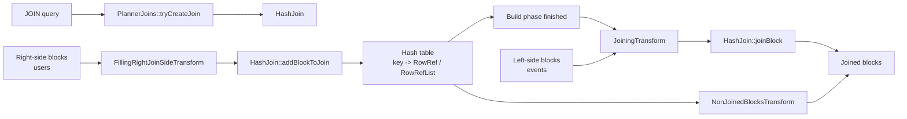

# Hash Join Internals

ClickHouse implements an in-memory hash join as a two-phase operation:

1. **Build:** read the right-side table and build a hash table from its join keys.
2. **Probe:** read blocks from the left-side table, look up each key in the hash table, and produce joined rows.

This page follows the ordinary `HashJoin` path. `ConcurrentHashJoin`, `GraceHashJoin`, and `SpillingHashJoin` use the same build/probe model but change how the right side is partitioned, built in parallel, or moved to disk.

## 1. High-Level Execution Flow

For a query such as:

```sql
SELECT
    events.user_id,
    events.event_name,
    users.plan
FROM events
LEFT JOIN users ON events.user_id = users.user_id;
```

`users` is normally the build side and `events` is the probe side.



The important source-level call paths are:

```text
PlannerJoins::tryCreateJoin
  -> HashJoin::HashJoin
  -> HashJoin::chooseMethod
  -> HashJoin::dataMapInit
```

```text
FillingRightJoinSideTransform::work
  -> IJoin::addBlockToJoin
  -> HashJoin::addBlockToJoin
  -> HashJoinMethods<...>::insertFromBlock
```

```text
JoiningTransform::readExecute
  -> IJoin::joinBlock
  -> HashJoin::joinBlock
  -> HashJoinMethods<...>::joinBlockImpl
```

## 2. How ClickHouse Chooses a JOIN Algorithm

`PlannerJoins::tryCreateJoin` examines `join_algorithm`, the JOIN kind and strictness, the right-side storage, and memory/spilling settings.

The relevant implementations include:

| Algorithm | Main class | Main use |
|---|---|---|
| `direct` | `DirectJoin` | Key-value lookup against a compatible storage such as a dictionary |
| `hash` | `HashJoin` | Single in-memory hash table |
| `parallel_hash` | `ConcurrentHashJoin` | Several hash tables built and probed in parallel |
| `grace_hash` | `GraceHashJoin` | Bucketed hash join that can use temporary storage |
| `partial_merge` | `MergeJoin` | Sort-merge strategy with a sorted right side |
| `full_sorting_merge` | `FullSortingMergeJoin` | Full sort-merge strategy |
| `auto` | `JoinSwitcher` or a spilling hash path | Starts with an eligible strategy and may change when limits are reached |

The default algorithm list can change between ClickHouse releases. Inspect it on the running server instead of assuming a value:

```sql
SELECT name, value, changed
FROM system.settings
WHERE name IN
(
    'join_algorithm',
    'parallel_hash_join_threshold',
    'max_bytes_before_external_join',
    'max_bytes_ratio_before_external_join'
);
```

To force the ordinary hash path for investigation:

```sql
SET join_algorithm = 'hash';
```

Verify the selected implementation with `EXPLAIN`:

```sql
EXPLAIN PLAN
SELECT *
FROM events
LEFT JOIN users ON events.user_id = users.user_id;
```

In a verbose plan, the JOIN description includes its kind, strictness, conditions, and algorithm. Depending on the ClickHouse version and `EXPLAIN` options, the algorithm can appear as `HashJoin`, `ConcurrentHashJoin`, or another implementation name.

## 3. `TableJoin`: The Semantic Description

`TableJoin` describes what the JOIN means before `HashJoin` executes it. It carries:

- JOIN kind: `Inner`, `Left`, `Right`, or `Full`.
- Strictness: `All`, `Any`, `Semi`, `Anti`, or `Asof`.
- Left and right key names for each `ON` clause.
- Additional conditions from the `ON` expression.
- Output columns required from the right side.
- Size limits and overflow behavior.
- Settings such as `join_use_nulls` and `join_any_take_last_row`.

`HashJoin` reads this description in its constructor and creates the matching map layout and dispatch path.

Multiple disjuncts in an `ON` condition may require multiple maps:

```sql
SELECT *
FROM left_table AS l
INNER JOIN right_table AS r
    ON l.id = r.id OR l.email = r.email;
```

Conceptually:

```text
clause 0: l.id    = r.id     -> map[0]
clause 1: l.email = r.email  -> map[1]
```

The probe phase searches the maps for the applicable clauses and avoids emitting the same right-side row twice when disjuncts overlap.

## 4. Build Phase: Reading the Right Side

`FillingRightJoinSideTransform` consumes blocks from the right-side pipeline.

For each block:

```text
FillingRightJoinSideTransform::work
  -> join->addBlockToJoin(block, rows, check_limits=true)
```

Inside `HashJoin::addBlockToJoin`:

1. Materialize constant or special column representations as needed.
2. Extract the right-side key columns.
3. Preserve the right-side columns needed in the result.
4. Extract a null map from nullable keys.
5. Skip hash-table insertion for keys containing `NULL`.
6. Insert each usable key into the selected map.
7. Store a reference to the source block and row.
8. Check row and byte limits.

The hash table does not copy every result value into each cell. A cell usually points to a stored right-side row:

```text
hash(key)
  -> hash-table cell
  -> RowRef { block_no, row_no }
  -> stored right-side columns
```

For `ALL` joins, one key may point to a list:

```text
42 -> RowRefList
      ├── { block 0, row 3 }
      ├── { block 1, row 8 }
      └── { block 1, row 9 }
```

This separation keeps the hash cells smaller and allows result columns to be gathered from stored blocks during probing.

### Build Completion

When all right-side streams finish, the last `FillingRightJoinSideTransform` calls:

```text
HashJoin::onBuildPhaseFinish
```

Post-build work can include:

- Finalizing statistics.
- Shrinking stored blocks.
- Preparing used-row flags.
- Converting eligible dense integer-key maps to a fixed hash map.
- Publishing a runtime filter when the selected map supports it.

Only after the build signal is complete does the ordinary `FillRightFirst` pipeline allow left-side probing to proceed.

## 5. Choosing the Hash-Table Key Representation

`HashJoin::chooseMethod` selects a specialized map type from the key columns.

| Key shape | Typical map type |
|---|---|
| One 8-bit integer | `key8` |
| One 16-bit integer | `key16` |
| One 32-bit integer | `key32` |
| One 64-bit integer | `key64` |
| Fixed keys totaling up to 4 bytes | `keys32` |
| Fixed keys totaling up to 8 bytes | `keys64` |
| Fixed keys totaling up to 16 bytes | `keys128` |
| Fixed keys totaling up to 32 bytes | `keys256` |
| One `String` | `key_string` |
| One `FixedString` | `key_fixed_string` |
| Other or wider composite keys | `hashed` |

For example:

```sql
-- Usually key64
ON left.user_id = right.user_id

-- Can be packed into keys128 when the fixed widths fit
ON left.tenant_id = right.tenant_id
AND left.user_id = right.user_id

-- Usually key_string
ON left.email = right.email

-- Falls back to a serialized composite hash when it cannot be packed
ON left.string_key = right.string_key
AND left.array_key = right.array_key
```

A single non-nullable `LowCardinality(String)` or `LowCardinality(FixedString)` key may use a dictionary-aware map. Nullable low-cardinality keys and unsupported nested types fall back to the regular materialized path.

`ConcurrentHashJoin` uses two-level variants of several map types so different buckets can be handled independently.

## 6. Map Payload: `ANY`, `ALL`, and `ASOF`

`HashJoin` dispatches among three payload families:

```cpp
using MapsOne = MapsTemplate<RowRef>;
using MapsAll = MapsTemplate<RowRefList>;
using MapsAsof = MapsTemplate<AsofRowRefs>;
```

### `ANY`

`ANY` keeps one matching row for each right-side key:

```text
key -> RowRef
```

`join_any_take_last_row` controls whether a later right-side row replaces an existing value. Do not rely on a particular duplicate row unless the data model or query makes the choice deterministic.

### `ALL`

`ALL` keeps every matching right-side row:

```text
key -> RowRefList
```

During probing, a left row is replicated once for every matching right row. This is why a join can produce far more rows than either input.

### `ASOF`

An ASOF hash join needs at least one equality key plus an ordered ASOF key:

```sql
SELECT *
FROM trades AS t
ASOF LEFT JOIN quotes AS q
    ON t.symbol = q.symbol
   AND t.time >= q.time;
```

The equality portion chooses a hash-table entry. The ASOF structure then finds the nearest qualifying value according to the inequality.

## 7. Probe Phase: Reading the Left Side

`JoiningTransform` receives left-side chunks after the build phase is ready.

The core path is:

```text
JoiningTransform::transform
  -> JoiningTransform::readExecute
  -> HashJoin::joinBlock
  -> joinDispatch(kind, strictness, map type)
  -> HashJoinMethods<...>::joinBlockImpl
```

For each left-side row, the implementation:

1. Extracts and materializes the left key columns.
2. Computes the key using the same representation selected during the build.
3. Looks up the key in one or more maps.
4. Applies any additional `ON` filter.
5. Gathers right-side result columns for matching rows.
6. Emits defaults or `NULL` for a non-match when the JOIN kind requires it.
7. Replicates left rows for `ALL` matches.
8. Marks used right-side rows when `RIGHT` or `FULL` semantics require a later non-joined pass.

`JoinResult` can return the result in multiple blocks. This prevents a single large match set from forcing one unbounded output block.

## 8. How JOIN Kind Changes the Result

Assume these inputs:

```text
left_table                right_table
+----+-------+            +----+--------+
| id | event |            | id | plan   |
+----+-------+            +----+--------+
|  1 | view  |            |  1 | free   |
|  2 | buy   |            |  1 | trial  |
|  3 | login |            |  4 | paid   |
+----+-------+            +----+--------+
```

### `INNER ALL JOIN`

Only matching keys remain, and duplicate right-side keys multiply rows:

```text
1, view, free
1, view, trial
```

### `LEFT ALL JOIN`

All left rows remain:

```text
1, view,  free
1, view,  trial
2, buy,   <default or NULL>
3, login, <default or NULL>
```

### `LEFT ANY JOIN`

At most one right row is selected for each left row:

```text
1, view, <one matching plan>
2, buy,  <default or NULL>
3, login,<default or NULL>
```

### `RIGHT` and `FULL`

The normal probe phase tracks which right-side rows were used. After all left streams finish, `NonJoinedBlocksTransform` or the equivalent non-joined stream reads the unused right rows.

For the example, the right row `(4, paid)` is emitted with default or `NULL` values for the left columns.

## 9. `NULL` Keys and Outer-Join Defaults

Hash-join equality follows SQL-style null behavior:

```text
NULL does not equal NULL
```

During the build phase, rows with `NULL` in any equality-key component are not inserted into the normal hash map. During probing, a left row with a null key is treated as unmatched.

`join_use_nulls` controls output values for missing rows:

```sql
SET join_use_nulls = 0; -- use the data type's default value
SET join_use_nulls = 1; -- make outer-side result columns Nullable and use NULL
```

Example:

```sql
SELECT *
FROM
(
    SELECT arrayJoin([1, 2]) AS id
) AS l
LEFT JOIN
(
    SELECT 1 AS id, 'found' AS value
) AS r USING (id)
ORDER BY id;
```

With `join_use_nulls = 0`, the missing `String` value is usually an empty string. With `join_use_nulls = 1`, it is `NULL`.

## 10. Memory Limits and Spilling

The ordinary `HashJoin` keeps its right-side map and stored blocks in memory. The main controls are:

| Setting | Purpose |
|---|---|
| `max_rows_in_join` | Maximum number of right-side rows in the join |
| `max_bytes_in_join` | Maximum in-memory join size |
| `join_overflow_mode` | What happens when the row or byte limit is reached |
| `max_bytes_before_external_join` | Absolute threshold for automatic external hash-join processing |
| `max_bytes_ratio_before_external_join` | Threshold derived from available memory |
| `grace_hash_join_initial_buckets` | Initial partition count for grace hash join |
| `grace_hash_join_max_buckets` | Maximum partition count for grace hash join |
| `max_joined_block_size_rows` | Target maximum rows in a joined output block |
| `joined_block_split_single_row` | Allows one highly duplicated left row to be split across output blocks |

Inspect the effective values:

```sql
SELECT name, value, changed
FROM system.settings
WHERE name IN
(
    'max_rows_in_join',
    'max_bytes_in_join',
    'join_overflow_mode',
    'max_bytes_before_external_join',
    'max_bytes_ratio_before_external_join',
    'grace_hash_join_initial_buckets',
    'grace_hash_join_max_buckets',
    'max_joined_block_size_rows',
    'joined_block_split_single_row'
)
ORDER BY name;
```

### Ordinary Hash vs Grace Hash

```text
HashJoin
  right side -> one in-memory map -> probe left side

GraceHashJoin
  right side -> hash partitions
               ├── active bucket in memory
               └── other buckets on temporary storage
  left side  -> same partitioning -> process matching bucket pairs
```

If the right side does not fit comfortably in memory, use an eligible spilling configuration or choose `grace_hash`. Spilling also requires temporary storage to be configured.

## 11. Row Explosion and Output-Block Splitting

An `ALL` join can produce a large Cartesian multiplication for a single key:

```text
1 left row × 5,000,000 matching right rows = 5,000,000 result rows
```

This can create a large intermediate block even when the input blocks are small.

Useful controls:

```sql
SET max_joined_block_size_rows = 65536;
SET joined_block_split_single_row = 1;
```

`joined_block_split_single_row` requires a non-zero joined-block row limit. It lets the join return one heavily duplicated left row over several result blocks.

This setting changes block production, not SQL semantics: the total result row count remains the same.

## 12. Verification Script

The following script demonstrates `ALL`, `ANY`, outer defaults, and duplicate-key multiplication.

```sql
DROP TABLE IF EXISTS join_left;
DROP TABLE IF EXISTS join_right;

CREATE TABLE join_left
(
    id UInt64,
    event String
)
ENGINE = Memory;

CREATE TABLE join_right
(
    id UInt64,
    plan String
)
ENGINE = Memory;

INSERT INTO join_left VALUES
    (1, 'view'),
    (2, 'buy'),
    (3, 'login');

INSERT INTO join_right VALUES
    (1, 'free'),
    (1, 'trial'),
    (4, 'paid');

SET join_algorithm = 'hash';

SELECT 'INNER ALL' AS test, *
FROM join_left AS l
INNER ALL JOIN join_right AS r ON l.id = r.id
ORDER BY l.id, r.plan;

SELECT 'LEFT ALL' AS test, *
FROM join_left AS l
LEFT ALL JOIN join_right AS r ON l.id = r.id
ORDER BY l.id, r.plan;

SELECT 'LEFT ANY' AS test, *
FROM join_left AS l
LEFT ANY JOIN join_right AS r ON l.id = r.id
ORDER BY l.id;

SET join_use_nulls = 1;

SELECT 'FULL ALL' AS test, *
FROM join_left AS l
FULL ALL JOIN join_right AS r ON l.id = r.id
ORDER BY coalesce(l.id, r.id), r.plan;
```

### Verify the Plan

```sql
EXPLAIN PLAN indexes = 1
SELECT l.id, l.event, r.plan
FROM join_left AS l
LEFT ALL JOIN join_right AS r ON l.id = r.id;
```

### Verify Runtime Counters

Hash-join processors update profile events such as:

- `JoinBuildTableRowCount`
- `JoinProbeTableRowCount`
- `JoinResultRowCount`
- `JoinBuildPostProcessingMicroseconds`
- `JoinNonJoinedTransformRowCount`

Check which join-related events exist in the running version:

```sql
SELECT event, value, description
FROM system.events
WHERE event ILIKE '%Join%'
ORDER BY event;
```

For one completed query:

```sql
SYSTEM FLUSH LOGS;

SELECT
    query_id,
    ProfileEvents['JoinBuildTableRowCount'] AS build_rows,
    ProfileEvents['JoinProbeTableRowCount'] AS probe_rows,
    ProfileEvents['JoinResultRowCount'] AS result_rows,
    memory_usage
FROM system.query_log
WHERE type = 'QueryFinish'
  AND query_id = '<query_id>';
```

## 13. Troubleshooting Checklist

### The JOIN Uses Too Much Memory

1. Confirm which side is used to build the hash table.
2. Check whether the planner swapped the inputs.
3. Compare the right-side row count with `max_rows_in_join`.
4. Compare memory usage with `max_bytes_in_join`.
5. Inspect `join_algorithm` and external-join thresholds.
6. Reduce right-side columns before the JOIN.
7. Filter the right side earlier.
8. Consider `parallel_hash`, `grace_hash`, or a direct join when appropriate.

### The Result Has More Rows Than Expected

1. Check for duplicate keys on the right side.
2. Confirm whether the query uses `ALL` or `ANY`.
3. Count rows per key:

```sql
SELECT id, count()
FROM join_right
GROUP BY id
HAVING count() > 1
ORDER BY count() DESC;
```

4. Check whether multiple `ON` disjuncts can match the same row.
5. Inspect additional non-equality conditions in the `ON` clause.

### A Right-Side Row Is Missing

1. Check whether any key component is `NULL`.
2. Confirm matching key data types.
3. Check `join_any_take_last_row` when duplicate right keys exist.
4. Verify that a right-side `ON` filter did not reject the row.
5. Use `ALL` instead of `ANY` when every duplicate must be returned.

### A Query Is Slow Even Though the Hash Table Is Small

1. Inspect the probe-side row count.
2. Check whether string or wide composite keys force a more expensive map.
3. Look for a large output multiplier.
4. Check whether materialization or nullable-key processing dominates.
5. Compare `hash` with `parallel_hash` using the same data and settings.
6. Capture CPU samples and use the [flame-graph guide](../Profiling/ClickHouse_flameGraph_func.md).

## 14. Key Source Files

| File | Responsibility |
|---|---|
| `src/Planner/PlannerJoins.cpp` | Chooses and constructs the JOIN implementation |
| `src/Interpreters/TableJoin.h` | Stores analyzed JOIN semantics and settings |
| `src/Interpreters/HashJoin/HashJoin.h` | `HashJoin` state, map variants, stored right-side data |
| `src/Interpreters/HashJoin/HashJoin.cpp` | Constructor, key-method selection, build and probe dispatch |
| `src/Interpreters/HashJoin/HashJoinMethods.h` | Templated JOIN-kind and strictness implementation |
| `src/Interpreters/HashJoin/HashJoinMethodsImpl.h` | Map insertion and probing details |
| `src/Interpreters/HashJoin/KeyGetter.h` | Extracts and hashes keys in the selected representation |
| `src/Interpreters/HashJoin/JoinUsedFlags.h` | Tracks right-side rows used by RIGHT/FULL joins |
| `src/Interpreters/RowRefs.h` | `RowRef`, `RowRefList`, and ASOF row references |
| `src/Processors/Transforms/JoiningTransform.cpp` | Build-side filling, left-side probing, non-joined output |
| `src/QueryPipeline/QueryPipelineBuilder.cpp` | Connects right-build and left-probe processors |
| `src/Processors/QueryPlan/JoinStep.cpp` | Builds the physical JOIN pipeline |
| `src/Interpreters/ConcurrentHashJoin.cpp` | Parallel hash-join implementation |
| `src/Interpreters/GraceHashJoin.cpp` | Bucketed external hash-join implementation |
| `src/Interpreters/SpillingHashJoin.cpp` | Switches an eligible hash join to spilling execution |

## 15. Summary

The ordinary ClickHouse hash join builds a specialized in-memory map from the right side, stores references to the required right-side rows, and then probes that map with left-side blocks. JOIN kind and strictness determine whether the map holds one row, all rows, or ASOF lookup state; they also determine filtering, row replication, defaults, and the final non-joined-row pass.

When debugging a JOIN, identify four things first:

1. The selected algorithm.
2. The build side and its size.
3. The key representation and duplicate-key cardinality.
4. The JOIN kind and strictness.

Those four facts explain most differences in memory use, result cardinality, and execution time.
