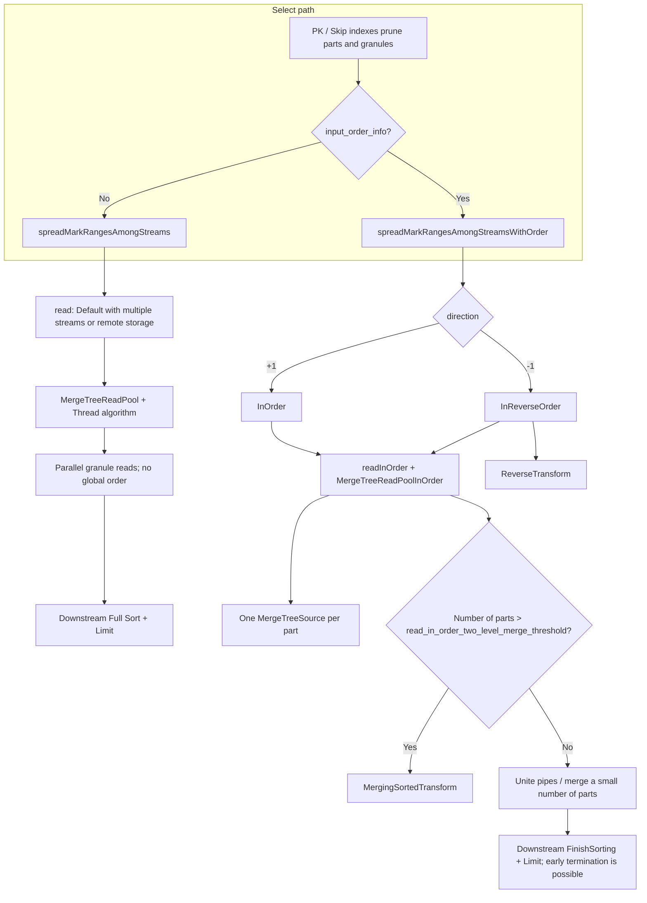

# Three MergeTree Read Modes: Default / InOrder / InReverseOrder

This document explains how ClickHouse MergeTree selects among **three read types** (`MergeTreeReadType`) during query execution, how their implementations differ, and how to verify their behavior. It is based on the source code in the current repository (26.2).

---

## 1. Enum Definition

Defined in: `src/Storages/MergeTree/MergeTreeReadTask.h`

```cpp
enum class MergeTreeReadType : uint8_t
{
    /// Default: MergeTreeReadPool, parallel streams, tasks split by mark; global sorting-key order is not guaranteed
    Default,

    /// Read in sorting-key order; the number of output ports usually equals the number of parts; num_streams is ignored
    InOrder,

    /// Same as InOrder, but reads marks within each part from back to front and adds ReverseTransform
    InReverseOrder,

    /// Used only for parallel replicas (not covered in this document)
    ParallelReplicas,
};
```

The `ReadType: Default | InOrder | InReverseOrder` value in EXPLAIN output is produced by `ReadFromMergeTree::readTypeToString()` (`ReadFromMergeTree.cpp`).

---

## 2. When Is Each Mode Selected?

### 2.1 Decision Point

After PK and skip-index pruning produces `parts_with_ranges`, `ReadFromMergeTree` follows one of these paths:

| Condition | Call path | Resulting ReadType |
|------|----------|---------------|
| `query_info.input_order_info == nullptr` | `spreadMarkRangesAmongStreams()` | **Default** |
| `query_info.input_order_info != nullptr` | `spreadMarkRangesAmongStreamsWithOrder()` | **InOrder** or **InReverseOrder** |

Relevant source code (approximately lines 3048–3059):

```cpp
if (query_info.input_order_info)
    return spreadMarkRangesAmongStreamsWithOrder(..., query_info.input_order_info);
return spreadMarkRangesAmongStreams(...);
```

### 2.2 How `input_order_info` Is Produced

- Setting: `optimize_read_in_order` (default: `1`); the query-plan layer also has `query_plan_read_in_order`.
- Optimizer: `ReadInOrderOptimizer` (`InterpreterSelectQuery` / `optimizeReadInOrder.cpp`).
- High-level conditions:
  - `ORDER BY` (or certain `GROUP BY` cases) matches a **prefix of the table sorting key**;
  - It is not combined with `FINAL` or certain complex clauses (see the official [ORDER BY data-reading optimization](https://clickhouse.com/docs/sql-reference/statements/select/order-by#optimization-of-data-reading)).
- Once enabled, it calls `ReadFromMergeTree::requestReadingInOrder(prefix_size, direction, read_limit)`.

Key fields of `InputOrderInfo` (`src/Storages/SelectQueryInfo.h`):

| Field | Meaning |
|------|------|
| `used_prefix_of_sorting_key_size` | Number of sorting-key prefix columns already ordered according to storage order |
| `direction` | `+1` → InOrder (same direction as ASC), `-1` → InReverseOrder (reverse direction) |
| `limit` | Without WHERE, `LIMIT+OFFSET` can be pushed down to the read stage (`getLimitForSorting`) |
| `sort_description_for_merging` | SortDescription used when merging multiple ordered streams |

```cpp
// Inside requestReadingInOrder (approximately lines 2818–2820)
analyzed_result_ptr->read_type = (query_info.input_order_info->direction > 0)
    ? ReadType::InOrder
    : ReadType::InReverseOrder;
```

**Note**: With `FINAL` and reverse in-order reading, `requestReadingInOrder` returns `false` (approximately lines 2795–2798) and falls back to a regular read.

---

## 3. Execution-Path Overview



### 3.1 Secondary Routing Inside `read()`

`ReadFromMergeTree::read()` (approximately lines 803–847):

| read_type | Condition | Actual read pool |
|-----------|------|----------|
| `ParallelReplicas` | Parallel replicas | `readFromPoolParallelReplicas` |
| `Default` | `max_streams > 1` or all data is on remote storage | `readFromPool` → **MergeTreeReadPool** |
| `Default` | Single stream + local storage | `readInOrder(..., Default, limit=0)`, with **ConcatProcessor** if needed |
| `InOrder` / `InReverseOrder` | Always | `readInOrder` → **MergeTreeReadPoolInOrder** |

---

## 4. Comparison of the Three Modes

| Dimension | **Default** | **InOrder** | **InReverseOrder** |
|------|-------------|-------------|---------------------|
| **Trigger** | No `input_order_info` | `direction > 0` | `direction < 0` |
| **Read pool** | `MergeTreeReadPool` (tasks can be stolen) | `MergeTreeReadPoolInOrder` | Same as InOrder |
| **`preservesOrderOfRanges()`** | `false` | `true` | `true` |
| **Select algorithm** | `MergeTreeThreadSelectAlgorithm` | `MergeTreeInOrderSelectAlgorithm` | `MergeTreeInReverseOrderSelectAlgorithm` |
| **Parallelism** | `num_streams` streams, with marks balanced across parts | Usually **one stream per part** | Same as InOrder |
| **Mark order within a part** | Arbitrary across threads | **Front to back** | **Back to front** |
| **Small LIMIT** | No early termination via `input_order_info.limit` | With `has_limit_below_one_block`, each task usually takes only **one** mark range | Same as the left, but ranges are taken from the end |
| **`reader_settings.read_in_order`** | `false` | `true` | `true` |
| **Pipeline tail** | Multiple unordered streams; a single stream may use Concat | `MergingSorted` with multiple parts; optional VirtualRow | Same as InOrder + **`ReverseTransform`** |
| **Typical ORDER BY LIMIT** | Full-table read + Full Sort | Ordered read + FinishSorting + early termination | Same as InOrder, in the opposite direction |
| **Additional reverse behavior** | — | Direct output from `task.read()` | Buffers multiple chunks, emits them in LIFO order, then reverses rows |

---

## 5. Default (Default Parallel Read)

### 5.1 Behavior

- **Entry point**: `spreadMarkRangesAmongStreams` → `read(..., ReadType::Default, num_streams, ...)`.
- **`MergeTreeReadPool::getTask`**: Threads split and steal tasks across marks in multiple parts; **global sorting-key order is not guaranteed**.
- Best suited for queries without the read-in-order optimization, or where `ORDER BY` does not match storage order.

### 5.2 Observed Performance (`demo_pk_order`, 10 Million Rows)

```text
SETTINGS optimize_read_in_order = 0
Processed 10.00 million rows, 80.00 MB
Elapsed ~0.032 s
```

EXPLAIN shows `ReadType: Default`; Sorting uses the full `Sort description` (rather than matching Prefix/Result descriptions).

---

## 6. InOrder (Forward Read by Sorting Key)

### 6.1 Behavior

- **Entry point**: `spreadMarkRangesAmongStreamsWithOrder`, with `read_type = InOrder` (`direction == 1`).
- **Read pool**: `MergeTreeReadPoolInOrder`; when `has_limit_below_one_block` is set, `getTask` takes only **one** mark range at a time (popping from the front).
- **Mark splitting** (`split_ranges`, direction=1): Splits granules from the **front** of the range according to `max_block_size`, minimizing reads for a small LIMIT.
- **Multiple parts**: Adds `MergingSortedTransform` when `parts.size() > read_in_order_two_level_merge_threshold` (default: 100); with fewer parts, streams are merged/united directly.
- **Downstream processing**: Commonly paired with `FinishSorting` (`Prefix sort description` = `Result sort description` in EXPLAIN), rather than a full sort.

### 6.2 Related Settings

| Setting | Default | Purpose |
|---------|------|------|
| `optimize_read_in_order` | 1 | Master switch |
| `query_plan_read_in_order` | 1 | Query-plan optimization |
| `read_in_order_use_buffering` | 1 | Buffering before merge |
| `read_in_order_two_level_merge_threshold` | 100 | Pre-merge threshold for multiple parts |
| `read_in_order_use_virtual_row` | 0 | Virtual-row optimization (primary keys across multiple parts) |

### 6.3 Observed Performance (`demo_pk_order`)

```text
SETTINGS optimize_read_in_order = 1
ORDER BY a ASC, b ASC LIMIT 10
Processed 32.77 thousand rows, 262.14 KB
Elapsed ~0.006 s
```

Approximately **4 parts × 8,192 rows/granule ≈ 32,768** rows: the first granule from each part is read, the global Top 10 are merged, and reading stops.

EXPLAIN shows `ReadType: InOrder`. `Granules: 1222/1222` is a **planning upper bound**; it does not mean that all 1,222 granules are read at runtime.

---

## 7. InReverseOrder (Reverse Read by Sorting Key)

### 7.1 Similarities to and Differences from InOrder

**Shared behavior**: `readInOrder` + `MergeTreeReadPoolInOrder` + one `MergeTreeSource` per part.

**Differences**:

1. **`getTask`**: Pops ranges from the **end** of `all_mark_ranges` (`MergeTreeReadPoolInOrder.cpp`).
2. **`split_ranges`** (direction≠1): Splits granules from the **end** of the range (the comment explains that reverse reading must reverse the entire segment in memory, so it uses finer splits).
3. **`MergeTreeInReverseOrderSelectAlgorithm`**: Pushes the chunks read by a task onto a stack, then emits them in LIFO order.
4. **Pipeline**: Adds **`ReverseTransform`** to the pipe returned by `readInOrder` (reversing row order within each block).

### 7.2 Verifying with EXPLAIN

```sql
EXPLAIN actions = 1, indexes = 1
SELECT a, b FROM demo_pk_order
ORDER BY a DESC, b DESC
LIMIT 10
SETTINGS optimize_read_in_order = 1;
-- Expected: ReadType: InReverseOrder, with ReverseTransform in the plan
```

---

## 8. Relationship to Other ORDER BY + LIMIT Optimizations

| Optimization | Relationship to the three ReadTypes |
|------|------------------------|
| **LIMIT pushdown to Sorting** | `tryPushDownLimit`: calls `updateLimit` when moving Limit → Sorting; all three read types may have downstream Sorting+Limit |
| **TopK (skip index / dynamic filtering)** | `tryOptimizeTopK`: applies to `ORDER BY` on a single column with `LIMIT`; independent of the InOrder path and requires a separate setting |
| **Lazy materialization** | `query_plan_optimize_lazy_materialization`: can be combined with InOrder |
| **Distributed LIMIT** | `distributed_push_down_limit`: shard-level LIMIT, independent of the local ReadType |

---

## 9. SQL Verification Scripts

### 9.1 Create and Populate the Table (Example)

```sql
DROP TABLE IF EXISTS demo_pk_order;

CREATE TABLE demo_pk_order
(
    a UInt32,
    b UInt32,
    payload String DEFAULT ''
)
ENGINE = MergeTree
ORDER BY (a, b)
SETTINGS index_granularity = 8192;

-- Example: 10 million rows
INSERT INTO demo_pk_order
SELECT
    intDiv(number, 100) AS a,
    number % 100 AS b,
    ''
FROM numbers(10000000);
```

### 9.2 Compare the Three ReadTypes

```sql
-- InOrder
EXPLAIN actions = 1, indexes = 1
SELECT a, b FROM demo_pk_order ORDER BY a ASC, b ASC LIMIT 10
SETTINGS optimize_read_in_order = 1;

SELECT a, b FROM demo_pk_order ORDER BY a ASC, b ASC LIMIT 10
SETTINGS optimize_read_in_order = 1;

-- InReverseOrder
EXPLAIN actions = 1, indexes = 1
SELECT a, b FROM demo_pk_order ORDER BY a DESC, b DESC LIMIT 10
SETTINGS optimize_read_in_order = 1;

-- Default
EXPLAIN actions = 1, indexes = 1
SELECT a, b FROM demo_pk_order ORDER BY a ASC, b ASC LIMIT 10
SETTINGS optimize_read_in_order = 0;

SELECT a, b FROM demo_pk_order ORDER BY a ASC, b ASC LIMIT 10
SETTINGS optimize_read_in_order = 0;
```

### 9.3 Inspect Actual Rows Read with `query_log`

```sql
SET log_queries = 1;

SELECT a, b FROM demo_pk_order ORDER BY a, b LIMIT 10
SETTINGS optimize_read_in_order = 1 FORMAT Null;

SELECT a, b FROM demo_pk_order ORDER BY a, b LIMIT 10
SETTINGS optimize_read_in_order = 0 FORMAT Null;

SELECT
    query_id,
    Settings['optimize_read_in_order'] AS rio,
    read_rows,
    result_rows,
    query_duration_ms
FROM system.query_log
WHERE type = 'QueryFinish'
  AND query LIKE '%demo_pk_order%'
  AND query NOT LIKE '%system.query_log%'
ORDER BY event_time DESC
LIMIT 5;
```

### 9.4 EXPLAIN Verification Checklist

| Check | InOrder | InReverseOrder | Default |
|--------|---------|----------------|---------|
| `ReadType` | `InOrder` | `InReverseOrder` | `Default` |
| Sorting | `Prefix` = `Result` | Same as the left | Only `Sort description` |
| ReverseTransform | No | Yes | No |
| Client-side Processed rows (small LIMIT) | Far fewer than the total table rows | Same order of magnitude | Close to a full-table read |

---

## 10. Key Source-Code Index

| Topic | File | Description |
|------|------|------|
| Enum | `src/Storages/MergeTree/MergeTreeReadTask.h` | `MergeTreeReadType` |
| Path selection | `src/Processors/QueryPlan/ReadFromMergeTree.cpp` | `spreadMarkRanges*`, `read()`, `requestReadingInOrder` |
| InOrder pool | `src/Storages/MergeTree/MergeTreeReadPoolInOrder.cpp` | `getTask`, single range for LIMIT |
| Default pool | `src/Storages/MergeTree/MergeTreeReadPool.cpp` | Parallel task stealing |
| Selection algorithms | `src/Storages/MergeTree/MergeTreeSelectAlgorithms.cpp` | Reverse buffering |
| Optimizer | `src/Storages/ReadInOrderOptimizer.cpp` | `getInputOrder` |
| Interpreter | `src/Interpreters/InterpreterSelectQuery.cpp` | `optimize_read_in_order`, `getLimitForSorting` |
| Query-plan optimization | `src/Processors/QueryPlan/Optimizations/optimizeReadInOrder.cpp` | `query_plan_read_in_order` |
| LIMIT pushdown | `src/Processors/QueryPlan/Optimizations/limitPushDown.cpp` | Sorting `updateLimit` |
| Input-order information | `src/Storages/SelectQueryInfo.h` | `InputOrderInfo` |
| Official test | `tests/queries/0_stateless/00940_order_by_read_in_order.sql` | read in order |

---

## 11. FAQ

**Q: If EXPLAIN shows the same Granules count, does that mean the optimization was not applied?**

A: No. Granules is the **upper bound on readable granules** after index pruning. Early termination for InOrder + LIMIT happens during the **execution stage** (`getTask` processes ranges incrementally and the downstream Limit cancels further work). Inspect `Processed rows` or `system.query_log.read_rows` instead.

**Q: Why can a query still be fast with `optimize_read_in_order` disabled?**

A: The data may be in the page cache, the query may read only a few columns, or the measured time may be for EXPLAIN rather than SELECT.

**Q: How many rows does InOrder read when there are multiple parts?**

A: It is often on the order of `number of parts × rows in the first granule`. A global LIMIT can only be determined after merging multiple ordered streams, so the query does not necessarily read just one granule.

---

## 12. Revision History

| Date | Description |
|------|------|
| 2026-06-02 | Initial version: consolidated source-code notes for Default / InOrder / InReverseOrder and observed `demo_pk_order` results |
