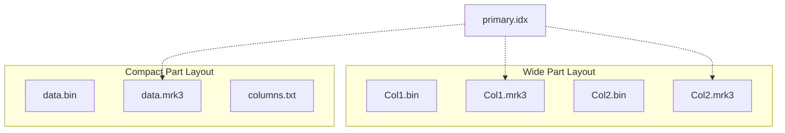
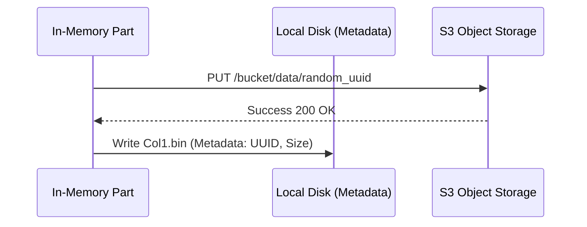
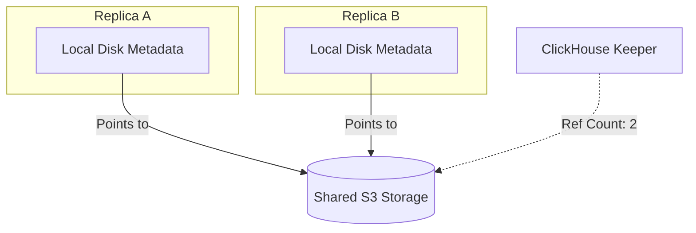
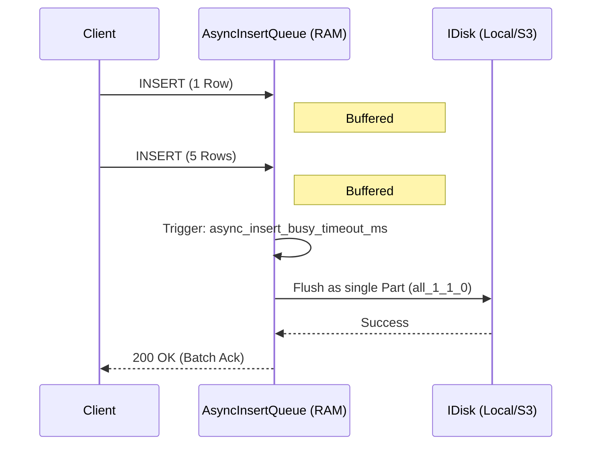

# ClickHouse Deep Dive: MergeTree Granules, Object Storage, and Zero-Copy Replication

This guide explores the deep technical internals of ClickHouse, focusing on how it stores data at the lowest level (MergeTree Granules and Mark Files), how it abstracts storage across local disks and cloud object storage (S3/Azure), how it efficiently replicates data across clusters without duplicating cloud storage (Zero-Copy Replication), and how it handles high-throughput small inserts (Asynchronous Inserts).

---

## 1. MergeTree Granules & Mark Engine

The `MergeTree` family of table engines is the core of ClickHouse. It relies on a sparse index, meaning ClickHouse does not index every single row. Instead, it groups rows into **granules** and indexes the first row of each granule.

### 1.1 Granules and the Sparse Index

A granule is the smallest indivisible dataset that ClickHouse reads when processing a query. Its size is controlled by `index_granularity` (default: 8192 rows). By default, ClickHouse uses **adaptive granularity**, meaning a granule might have fewer rows if the combined size of the rows exceeds `index_granularity_bytes` (default 10MB).

When a query is executed, ClickHouse uses the **primary index** (`primary.idx`) to find which granules *might* contain the requested data. To read these granules from the compressed column data files (`.bin`), it uses **mark files** (`.mrk2` / `.mrk3`).

### 1.2 Mark File Formats (`.mrk2`, `.mrk3`)

Marks act as a bridge between the primary index and the physically compressed data on disk. Since data in `.bin` files is grouped into compressed blocks (usually 64KB - 1MB), ClickHouse needs to know exactly where a granule starts within those blocks.

A mark essentially points to:
1. **Offset in the compressed file**: Where the compressed block begins.
2. **Offset in the uncompressed block**: Where the granule begins after decompressing the block.
3. **Number of rows**: In the case of adaptive granularity (`.mrk3`), it also stores the number of rows in this granule.

**Source Code Reference**: `src/Storages/MergeTree/MergeTreeIndexGranule.h` and `MergeTreeMarksLoader.cpp`.

### 1.3 Wide vs Compact Data Part Formats

ClickHouse creates a new **part** on disk for every insert (which are later merged in the background). Parts can be stored in two physical layouts:

*   **Wide Format**: Every column has its own `.bin` (data) and `.mrk3` (marks) file. This is highly efficient for reading specific columns but creates many files, which is problematic for small inserts or cloud storage.
*   **Compact Format**: All columns are interleaved into a single `data.bin` file and a single `data.mrk3` file. ClickHouse uses this format for small parts (controlled by `min_bytes_for_wide_part` and `min_rows_for_wide_part`).

### 1.4 Sparse Index Lookup Flow

1.  Query engine evaluates `WHERE` clause conditions.
2.  Intersects conditions with `primary.idx` to get a list of required granule ranges.
3.  Reads `.mrk3` files for the requested columns using `MergeTreeMarksLoader`.
4.  Jumps to the specific byte offsets in the `.bin` files, decompresses blocks, and streams rows to the execution pipeline.

---

## 2. Disk Abstractions & Object Storage

ClickHouse abstracts storage through the `IDisk` interface, allowing parts to be stored on local SSDs, RAM, or remote object storage (AWS S3, Azure Blob Storage, Google Cloud Storage) transparently.

### 2.1 The `IDisk` Interface

Defined in `src/Disks/IDisk.h`, this interface provides POSIX-like methods: `readFile`, `writeFile`, `listFiles`, `removeFile`, etc.

Key implementations:
*   `DiskLocal`: Standard local file system (`src/Disks/DiskLocal.cpp`).
*   `DiskObjectStorage`: Wrapper for cloud storage (`src/Disks/ObjectStorages/DiskObjectStorage.cpp`).

### 2.2 S3ObjectStorage and Metadata Files

Object storage (S3) is not a true file system; it's a key-value store. Furthermore, object storage charges per PUT/GET request, and latency is high. ClickHouse handles this using a **Metadata/Link architecture**.

When using `DiskObjectStorage` with S3:
1.  **Local Disk**: ClickHouse stores lightweight "metadata" files locally. For example, `/var/lib/clickhouse/disks/s3/data/default/table/all_1_1_0/Col1.bin`.
2.  **S3**: The actual massive chunk of data is written to an S3 bucket with a randomized key (e.g., `s3://bucket/data/ab/cd/abcd-1234-5678...`).

The local metadata file is essentially a pointer or "link" file containing the S3 object key, the file size, and reference counts (used in Zero-Copy).

**Source Code Reference**: `src/Disks/ObjectStorages/S3/S3ObjectStorage.cpp` and `src/Disks/ObjectStorages/MetadataStorageFromDisk.cpp`.

---

## 3. Zero-Copy Replication

When using ReplicatedMergeTree with S3, standard replication would mean Replica A writes the part to S3, and Replica B downloads it from Replica A (or S3) and uploads it *again* to S3. This doubles storage and network costs.

**Zero-Copy Replication** solves this. Since S3 is shared across replicas, Replica B only needs to download the *metadata* (the local link files pointing to the S3 objects) rather than the heavy `.bin` data.

### 3.1 ZooKeeper/Keeper Structure

Zero-copy replication relies heavily on ClickHouse Keeper (or ZooKeeper) to manage reference counts and distributed locks to ensure data isn't deleted while another replica is still using it.

Paths typically look like:
*   `/clickhouse/zero_copy/s3/metadata_key` -> Stores the reference count and nodes holding the part.

### 3.2 Reference Counts and Lock Management

When Replica A merges parts to create a new part `all_1_2_1`:
1. Replica A writes data to S3 and metadata locally.
2. Replica A registers the S3 objects in Keeper under `/clickhouse/zero_copy/` with `refcount = 1`.
3. Replica B receives replication log to fetch `all_1_2_1`.
4. Replica B sees the part exists in S3. It simply downloads the metadata from Replica A, writes it locally, and increments the `refcount` in Keeper to `2`.

When a part is dropped (e.g., after a merge or TTL):
1. Replicas delete their local metadata and decrement the `refcount` in Keeper.
2. Distributed locks ensure race conditions don't occur.
3. The replica that decrements the `refcount` to `0` executes the actual `DELETE` request against S3.

---

## 4. Asynchronous Inserts

MergeTree is designed for large batch inserts (1M+ rows per insert). Many small inserts (e.g., 1 row per second) create too many small parts (which triggers "Too many parts" errors) and overwhelms the background merge process, especially when using wide parts and S3.

`Asynchronous Inserts` solve this by buffering inserts in RAM before flushing them to disk as a single larger part.

### 4.1 AsyncInsertQueue

When `async_insert = 1` is enabled:
1. Inserts are sent to the `AsynchronousInsertQueue` (`src/Interpreters/AsynchronousInsertQueue.cpp`).
2. They are buffered in memory until either:
    *   `async_insert_busy_timeout_ms` is reached (default 200ms).
    *   `async_insert_max_data_size` is reached (default 1MB).

### 4.2 Batching and Buffer Flushing

Once a threshold is hit, the queue flushes the accumulated data into the standard insert pipeline. All the small inserts are written to disk as a single, well-formed compact or wide part.

### 4.3 Backpressure and Acknowledgment

If `wait_for_async_insert = 1` (default), the client's HTTP/TCP connection blocks until the buffer is flushed and the part is written to disk. This provides durability guarantees and natural **backpressure**: clients cannot overwhelm the server's memory because their requests hang until memory is freed by flushing to disk.

