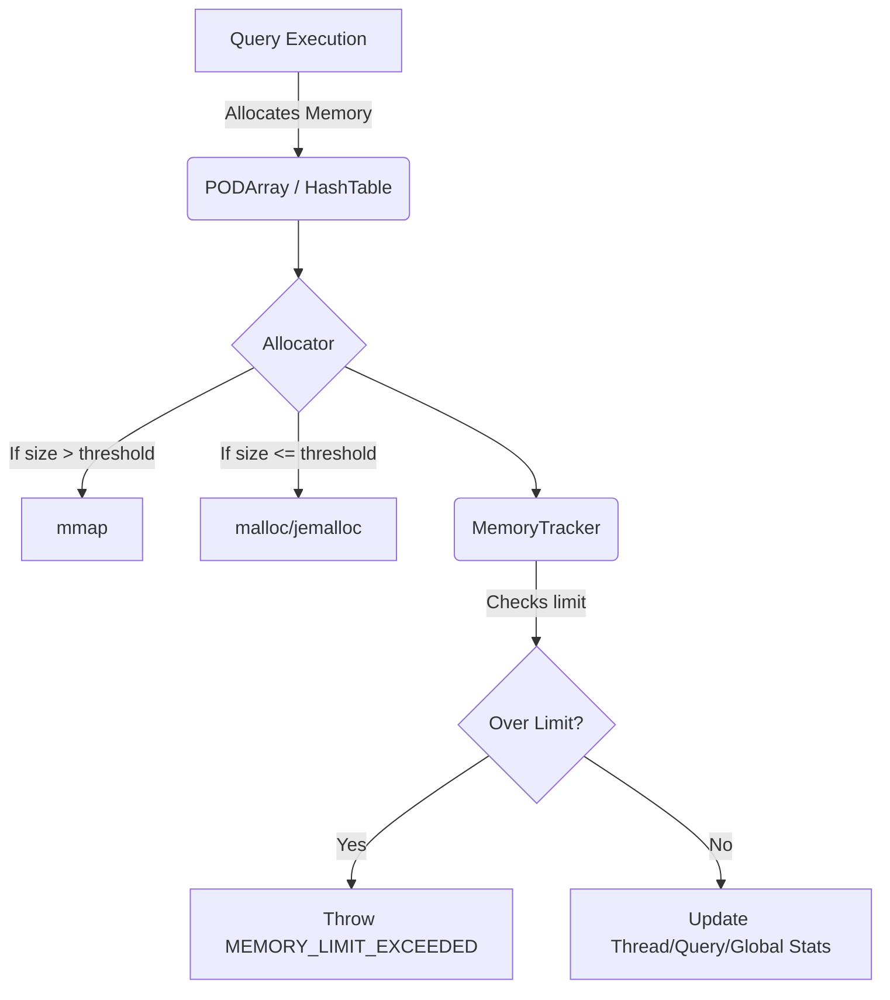

# ClickHouse Internal Developer Guide: Performance, SIMD Vectorization, and Memory Architecture

ClickHouse is famously fast, and its speed isn't just algorithmic—it's deeply tied to mechanical sympathy. It exploits modern CPU architecture (SIMD, cache lines, branch prediction) and employs rigorous memory management to squeeze every cycle out of the hardware.

This guide explores the low-level techniques ClickHouse uses to achieve its performance, focusing on SIMD vectorization, memory layout, and the tools available for performance profiling.

---

## 1. SIMD Vectorization and Data Layout

ClickHouse processes data in blocks (vectors/arrays) rather than row-by-row. This columnar processing model is perfectly suited for Single Instruction, Multiple Data (SIMD) execution.

### 1.1 `PODArray`: The Foundation of Columns

The core data structure in ClickHouse for storing primitive types (numbers, dates) is `PODArray` (Plain Old Data Array), defined in `src/Common/PODArray.h`.

**Key Design Characteristics of `PODArray`:**
- **64-byte Alignment:** The data pointer is aligned to 64 bytes (the size of a typical CPU cache line and AVX-512 vector width). This prevents false sharing and ensures optimal load/store performance.
- **SIMD Padding (15 Bytes):** The allocated memory always has a padding of up to 15 bytes at the end. This is a critical design choice: it allows SIMD loops to unconditionally read past the end of the actual data without risking page faults (segfaults), simplifying loop conditions and avoiding the need for a scalar "tail" loop in many cases.
- **No Initialization:** By default, memory is not zero-initialized upon allocation, saving CPU cycles unless explicitly requested.

```cpp
// Snippet inspired by src/Common/PODArray.h
template <typename T, size_t INITIAL_SIZE = 4096, typename Allocator = Allocator<false>, ...>
class PODArrayBase : private Allocator
{
    // ...
    void alloc(size_t bytes)
    {
        // Align to 64 bytes (cache line / AVX-512)
        // Add padding (e.g., 15 bytes for SIMD over-reads)
        size_t padded_bytes = bytes + 15;
        char * new_c_start = static_cast<char *>(Allocator::alloc(padded_bytes, 64));
        // ...
    }
};
```

### 1.2 SIMD Intrinsics (AVX2, AVX-512, ARM Neon)

ClickHouse heavily utilizes compiler auto-vectorization, but for critical paths, it uses explicit SIMD intrinsics.

- **String Parsing/Processing:** Functions in `src/Functions/` (e.g., string search, lower/upper case conversion) often use specialized loops.
- **Filtering:** When evaluating a `WHERE` clause, ClickHouse builds a filter mask (an array of `UInt8`). Filtering a column based on this mask is heavily vectorized.

```cpp
// Example: Vectorized filtering using AVX2 (Conceptual)
// Path: src/Columns/FilterDescription.cpp / src/Columns/ColumnsCommon.cpp
#include <immintrin.h>

void filterAVX2(const UInt8 * filter, const UInt32 * data, UInt32 * res, size_t size, size_t & res_size)
{
    size_t i = 0;
    size_t current_res_size = 0;
    
    // Process 8 elements at a time
    for (; i + 7 < size; i += 8)
    {
        __m256i f = _mm256_cvtepu8_epi32(_mm_loadl_epi64(reinterpret_cast<const __m128i*>(&filter[i])));
        __m256i d = _mm256_loadu_si256(reinterpret_cast<const __m256i*>(&data[i]));
        
        // Complex permute/compress logic to pack matching elements based on 'f' mask
        // ...
    }
    // Scalar tail handling (if padding wasn't sufficient for specific over-read)
    for (; i < size; ++i)
    {
        if (filter[i])
            res[current_res_size++] = data[i];
    }
    res_size = current_res_size;
}
```

### 1.3 `libdivide` and Fast Parsing

- **`libdivide`:** Division is notoriously slow on CPUs (often 10-40 cycles compared to 1 cycle for addition/multiplication). ClickHouse uses `libdivide` for cases where the divisor is constant across a block of data. It replaces division with a cheaper multiplication and bit-shift. (See `src/Common/libdivide.h`).
- **Fast Parsing:** ClickHouse has custom parsing routines for numbers and dates (`src/IO/ReadHelpers.h`). It avoids standard library `scanf` or `std::stod`, instead using lookup tables and SIMD (where applicable) to parse JSON, CSV, and TSV fields at gigabytes per second.

---

## 2. Memory Infrastructure and Tracking

ClickHouse tracks memory usage meticulously. A query cannot be allowed to OOM the entire server.



### 2.1 The `Allocator` and `Arena`

- **`Allocator` (src/Common/Allocator.h):** This is the base class for memory allocation. It wraps standard `malloc`/`mmap` but integrates directly with the `MemoryTracker`. It decides whether to use `mmap` for large allocations (to return memory immediately to the OS upon free) or standard `malloc` (usually backed by `jemalloc` for fast concurrent small allocations).
- **`Arena` (src/Common/Arena.h):** A bump-pointer allocator. Used extensively during aggregations (`GROUP BY`). When grouping strings, allocating a separate block for every unique string would destroy performance due to fragmentation and allocation overhead. Instead, strings are copied into large `Arena` blocks continuously. When the query finishes, the entire `Arena` is dropped instantly.

### 2.2 `MemoryTracker`

Every query, user, and the global server has an associated `MemoryTracker` (`src/Common/MemoryTracker.h`).

- **Hierarchy:** Trackers form a hierarchy (Thread -> Query -> User -> Global).
- **Tracking:** When `Allocator::alloc` is called, it increments the current thread's tracker. If the limit is exceeded, an exception is thrown before the allocation occurs.
- **`VectorWithMemoryTracking`:** Used in places where dynamic arrays are needed, automatically pushing tracking updates to the `MemoryTracker`.

---

## 3. Profiling & Observability

ClickHouse provides deep introspection into its own performance via system tables, enabling flame graphs and bottleneck analysis without external tools.

### 3.1 `system.trace_log`

The crown jewel of ClickHouse profiling. It samples the execution state of queries.

- **Trace Types:**
  - `CPU`: Samples the instruction pointer (call stack) when the thread is actively executing on the CPU (using `timer_create` / signals).
  - `Real`: Samples the call stack based on wall-clock time (useful for finding locks/I/O wait).
  - `Memory`: Samples call stacks when memory allocations occur.

**Generating a Flame Graph:**
You can query `system.trace_log` to generate data for Brendan Gregg's flame graph tools, or use the built-in clickhouse-client integration if configured.

```sql
-- Example: Finding CPU hotspots for a specific query
SELECT
    count(),
    arrayStringConcat(arrayMap(x -> demangle(addressToSymbol(x)), trace), '\n') AS stack
FROM system.trace_log
WHERE query_id = 'your_query_id' AND trace_type = 'CPU'
GROUP BY trace
ORDER BY count() DESC
LIMIT 10;
```

### 3.2 `system.query_log`

Logs execution stats for every query: execution time, memory usage (`memory_usage`), bytes read, OS profile events (page faults, context switches).

### 3.3 Diagnosing Bottlenecks (Developer Walkthrough)

**Scenario: A specific query is slow and uses too much memory.**

1.  **Identify the Query:** Run `SELECT * FROM system.query_log WHERE query = '...' ORDER BY event_time DESC LIMIT 1`. Note the `query_id` and `memory_usage`.
2.  **Check Query Plan:** Run `EXPLAIN PIPELINE ...` to see the physical execution plan and thread concurrency.
3.  **Memory Profiling:**
    - Enable memory profiling for the session: `SET memory_profiler_step = 1048576;` (Sample every 1MB allocated).
    - Run the query.
    - Analyze `system.trace_log`:
      ```sql
      SELECT count(), addressToLine(trace[1]) as func
      FROM system.trace_log
      WHERE trace_type = 'Memory' AND query_id = 'your_query_id'
      GROUP BY func ORDER BY count() DESC LIMIT 5;
      ```
4.  **CPU Profiling:**
    - If `system.query_log` shows `ProfileEvents['OSCPUVirtualTimeMicroseconds']` is close to `query_duration_ms * threads`, it's CPU bound.
    - Query `system.trace_log` with `trace_type = 'CPU'` to find the exact C++ function chewing up cycles (e.g., an un-vectorized loop in a custom aggregate function).

### 3.4 Perf and Release Builds

When diagnosing low-level SIMD issues (e.g., "did the compiler actually use AVX-512?"), external `perf` is necessary.
- Always profile on **RelWithDebInfo** or **Release** builds. Debug builds disable compiler optimizations, rendering profiling useless.
- Use `perf record -g -p <clickhouse_pid>` and `perf report` or `perf annotate` to view the generated assembly for the hot loops. ClickHouse functions are heavily inlined, so debug symbols are critical to trace assembly back to `src/Functions/`.
