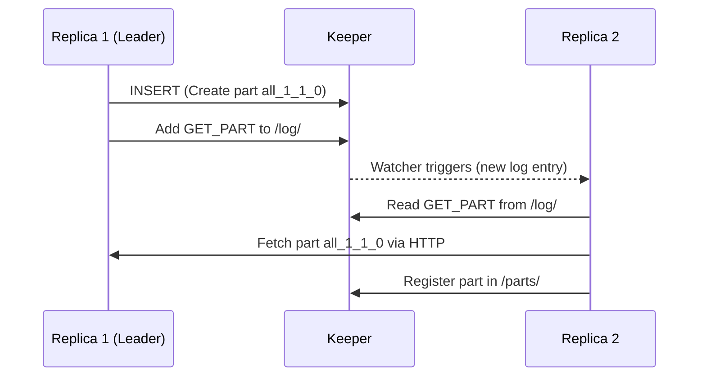
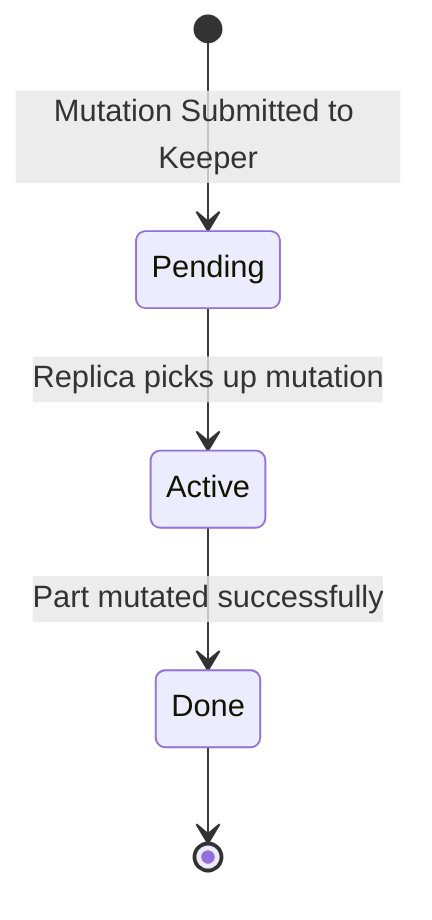
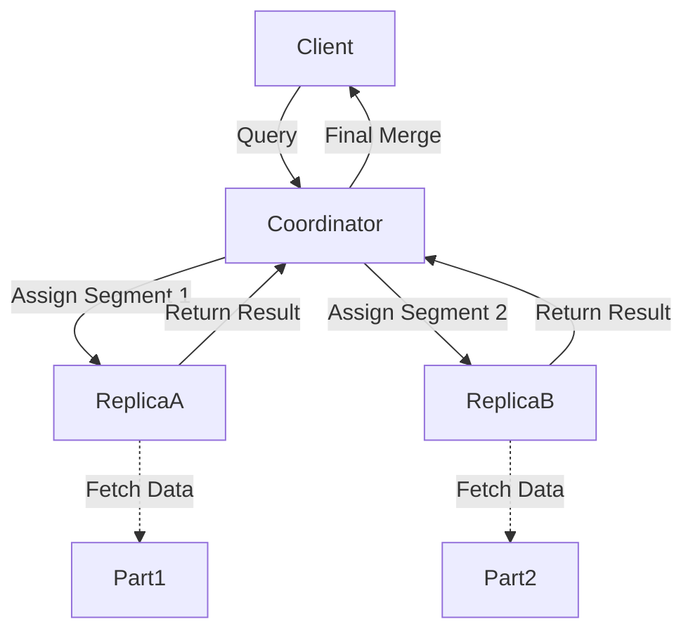

# ClickHouse Deep Dive: ReplicatedMergeTree, Keeper, and Parallel Replicas

This guide provides a comprehensive technical overview of replication, consensus, concurrency control, and parallel query execution in ClickHouse.

## 1. ReplicatedMergeTree Replication Log

The `ReplicatedMergeTree` engine relies on Apache ZooKeeper (or ClickHouse Keeper) to coordinate data replication across shards. The core mechanism is the replication log.

### Keeper Path Structure

ClickHouse stores metadata in Keeper. A typical structure for a replicated table looks like:

```text
/clickhouse/tables/{shard}/
├── log/                # The replication log
├── blocks/             # Deduplication blocks for idempotent inserts
├── parts/              # Active data parts
├── mutations/          # Pending and active mutations
├── leader_election/    # Ephemeral nodes for leader election
└── replicas/           # Metadata for each replica
```

### Log Entry Types

The replication log (`/clickhouse/tables/{shard}/log/`) contains sequential entries that dictate actions replicas must perform to synchronize.

- `GET_PART`: Instructs a replica to fetch a specific data part from another replica. This usually happens after an `INSERT` on a different node.
- `MERGE_PARTS`: Instructs a replica to merge a set of existing parts into a new, larger part. The leader replica assigns the new part name and records it in the log.
- `MUTATE_PART`: Commands a replica to apply a mutation (e.g., `ALTER TABLE ... DELETE`) to a specific part.
- `DROP_RANGE`: Instructs replicas to drop a partition or a range of parts.

### Execution Queue

Each replica maintains an in-memory queue (`ReplicatedMergeTreeQueue`) synced with the Keeper `log/`.
1. A background thread pulls new entries from Keeper.
2. Entries are added to the local queue.
3. Worker threads (from `background_pool`) pick up tasks from the queue (e.g., fetching parts, merging).

**Source Code Reference:**
- `src/Storages/MergeTree/ReplicatedMergeTreeLogEntry.h/cpp`
- `src/Storages/MergeTree/ReplicatedMergeTreeQueue.h/cpp`



## 2. ClickHouse Keeper & Concurrency

ClickHouse Keeper is a lightweight, drop-in replacement for ZooKeeper, built specifically for ClickHouse. It uses the Raft consensus algorithm.

### Keeper Consensus

Keeper nodes form a cluster, electing a leader. All writes (transactions) go through the leader, which replicates the log to followers. A quorum is required to commit a transaction.

**Source Code Reference:**
- `src/Keeper/KeeperServer.cpp`
- `src/Keeper/KeeperStateMachine.cpp`

### Transaction Batching

To achieve high throughput, Keeper batches multiple operations (e.g., ZooKeeper-like `multi` requests) into single Raft log entries. This significantly reduces the disk and network I/O overhead.

### Concurrency and Locking

ClickHouse employs several mechanisms for concurrency control:

- **TableLockHolder**: Provides read/write locks on table structures to prevent concurrent DDLs from clashing with reads/writes.
- **ALTER DDL Locks**: `ALTER` queries require exclusive locks. In replicated setups, this is coordinated via Keeper to ensure consistency across the cluster.
- **Part Mutation State Machine**: Mutations are asynchronous. When a mutation is issued, it's recorded in `/clickhouse/tables/{shard}/mutations/`. Replicas independently read this and apply the mutation to their local parts.



## 3. Parallel Replicas

Parallel replicas allow ClickHouse to distribute the execution of a single query across multiple replicas within a shard. This is crucial for scaling read performance on large datasets.

### Execution Modes

Set via `parallel_replicas_mode`:

- `custom_key`: Data is distributed based on a hash of a user-defined key.
- `sampling_key`: Relies on the table's `SAMPLE BY` key to divide data.
- `auto`: (More recent) ClickHouse dynamically coordinates reading without relying on specific keys.

### Coordinator Allocation and Dynamic Assignment

When a query runs with parallel replicas:
1. One node acts as the **Coordinator**.
2. The Coordinator breaks the query into smaller tasks (ranges of parts or marks).
3. Other replicas act as workers, requesting tasks from the Coordinator.
4. As a worker finishes a task, it dynamically requests another, ensuring load balancing even if replicas have different hardware or load.

**Source Code Reference:**
- `src/Processors/Sources/RemoteSource.cpp`
- `src/Interpreters/ClusterProxy/SelectStreamFactory.cpp`

