# Text Index: Writes and Queries

Based on the ClickHouse 26.2 source code (`MergeTreeIndexText.h/cpp`, `MergeTreeDataPartWriterOnDisk.cpp`, `MergeTreeDataSelectExecutor.cpp`, and `MergeTreeReaderTextIndex.cpp`).

A text index is an **inverted skip index**: it tokenizes rows within a part, maintains a posting list (a set of row numbers) for each token, and serializes the result into **three files** (`.idx` / `.dct` / `.pst`). At query time, it prunes data by intersecting the inverted index with the row range of each PK mark.

---

## 1. Overall Write Flow

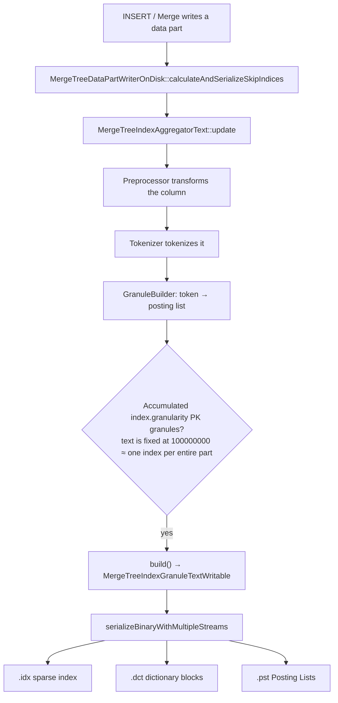

### Key Code Paths

**A part write triggers skip-index calculation** (`MergeTreeDataPartWriterOnDisk.cpp`):

```cpp
void MergeTreeDataPartWriterOnDisk::calculateAndSerializeSkipIndices(...)
{
    ...
    if (skip_index_accumulated_marks[i] == index_helper->index.granularity)
    {
        auto index_granule = skip_indices_aggregators[i]->getGranuleAndReset();
        index_granule->serializeBinaryWithMultipleStreams(index_streams);
        ...
    }
    ...
    skip_indices_aggregators[i]->update(skip_indexes_block, &pos, granule.rows_to_write);
}
```

**Building the inverted index in memory** (`MergeTreeIndexText.cpp`):

```cpp
void MergeTreeIndexTextGranuleBuilder::addDocument(std::string_view document)
{
    forEachTokenPadded(*tokenizer, document.data(), document.size(),
        [&](const char * token_start, size_t token_length)
        {
            ...
            posting_list_builder.add(static_cast<UInt32>(current_row), posting_lists);
        });
}
```

### Summary of Source-Code Comments

Design notes from `MergeTreeIndexText.h`:

- The text index is a skip index computed over **all documents** in a granule; internally, its postings contain row numbers.
- **`GRANULARITY` has no effect on text indexes**: during parsing, it is forced to `100000000` (`DEFAULT_TEXT_INDEX_GRANULARITY`), effectively creating one inverted index for the entire part.
- Text indexes **can be merged** during a merge (`MergeTextIndexesTask`), so they do not need to be rebuilt every time.

```cpp
// Parsers/ASTIndexDeclaration.cpp
/// Text index is always built for the whole part and granularity is ignored.
if (type && type->name == "text")
    return ASTIndexDeclaration::DEFAULT_TEXT_INDEX_GRANULARITY;  // 100'000'000
```

---

## 2. On-Disk Files: Three Data Streams + Three Mark Files

```cpp
// MergeTreeIndexText::getSubstreams()
{
    {Regular,              "",   ".idx"},   // sparse index
    {TextIndexDictionary,  ".dct", ".idx"}, // dictionary blocks
    {TextIndexPostings,    ".pst", ".idx"}  // Posting Lists
}
```

For `INDEX idx_tags tags TYPE text(tokenizer = 'array')`, the data-part directory contains:

```
all_1_1_0/
├── skp_idx_idx_tags.idx       ← sparse index (token → .dct offset)
├── skp_idx_idx_tags.idx.mrk2  ← .idx mark
├── skp_idx_idx_tags.dct       ← dictionary blocks (token + posting metadata)
├── skp_idx_idx_tags.dct.mrk2
├── skp_idx_idx_tags.pst       ← Roaring Bitmap for large posting lists
└── skp_idx_idx_tags.pst.mrk2
```

Index filenames use the `skp_idx_` prefix (`INDEX_FILE_PREFIX` in `MergeTreeIndices.cpp`).

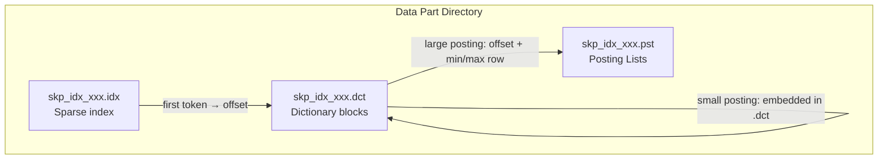

| File | Contents |
|------|------|
| `.idx` | Sparse index: the **first token** of each dictionary block → the block's file offset in `.dct` |
| `.dct` | Dictionary blocks: token list + posting metadata for each token; small postings are embedded directly |
| `.pst` | Large posting lists: Roaring Bitmap or raw VarUInt row numbers (split into blocks) |

`.idx` and `.dct` use the compressed write buffer; `.pst` **does not** use write-buffer compression (postings are already implicitly compressed while being built).

---

## 3. In-Memory Construction: The Inverted Index

The text index is an **inverted index**. A posting list stores **row numbers within the skip-index granule** (0-based), not global row numbers.

### Example

```sql
CREATE TABLE demo (
    id UInt64,
    tags Array(String),
    INDEX idx_tags tags TYPE text(tokenizer = 'array')  -- GRANULARITY is forced to 100000000
) ENGINE = MergeTree
ORDER BY id
SETTINGS index_granularity = 4;  -- 4 rows = 1 PK mark; the text inverted index covers the entire part

INSERT INTO demo VALUES
(0, ['api','web']),
(1, ['batch']),
(2, ['api']),
(3, ['canary']);
```

With `tokenizer='array'`, each array element is one token (with no further splitting).

The in-memory inverted index:

| token | posting list (row numbers within the granule) | cardinality |
|-------|----------------------------------|-------------|
| `api` | {0, 2} | 2 |
| `web` | {0} | 1 |
| `batch` | {1} | 1 |
| `canary` | {3} | 1 |

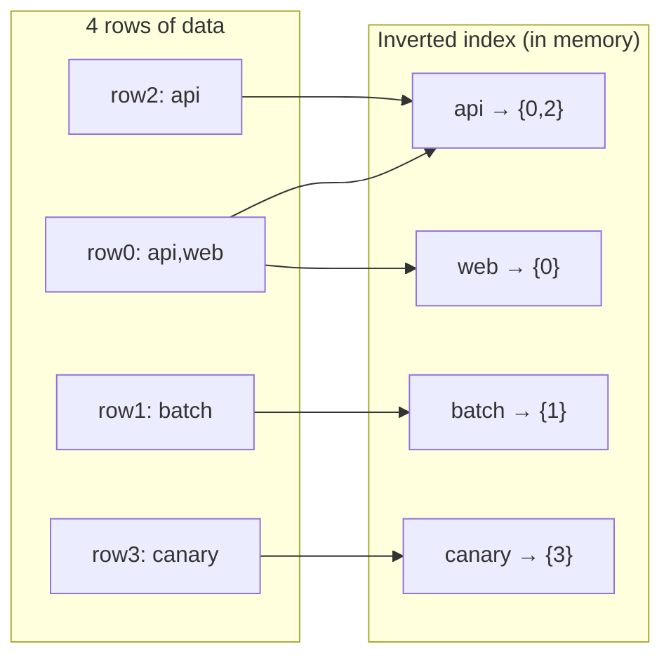

### Write Logic for an Array(String) Column

For an `Array(String)` column, all elements in each row are passed to `addDocument` before `incrementCurrentRow()` is called:

```cpp
if (isArray(index_column.type))
{
    for (size_t i = offset; i < offset + rows_read; ++i)
    {
        for (size_t element_idx = column_offsets[i - 1]; element_idx < column_offsets[i]; ++element_idx)
        {
            granule_builder.addDocument(ref);  // each array element
        }
        granule_builder.incrementCurrentRow();
    }
}
```

For a regular `String` column, the entire row is treated as one document and tokenized by a tokenizer such as `splitByNonAlpha`.

---

## 4. What `addDocument` Does: Which In-Memory Structures It Writes

`addDocument` is the inverted index's **single-document write entry point**. It does not write to disk; it only updates the in-memory structures in `MergeTreeIndexTextGranuleBuilder`. The actual writes to `.idx/.dct/.pst` happen later in `build()` → `serializeBinaryWithMultipleStreams`.

### 4.1 Source Code, Step by Step

```cpp
void MergeTreeIndexTextGranuleBuilder::addDocument(std::string_view document)
{
    forEachTokenPadded(
        *tokenizer,
        document.data(),
        document.size(),
        [&](const char * token_start, size_t token_length)
        {
            bool inserted;
            TokenToPostingsBuilderMap::LookupResult it;

            // ① Copy the token string into the arena for use as the hashmap key
            ArenaKeyHolder key_holder{std::string_view(token_start, token_length), *arena};
            tokens_map.emplace(key_holder, it, inserted);

            // ② Get this token's PostingListBuilder and write the current row number
            auto & posting_list_builder = it->getMapped();
            posting_list_builder.add(static_cast<UInt32>(current_row), posting_lists);

            // ③ Count processed token occurrences (including duplicate tokens)
            ++num_processed_tokens;
            return false;  // false = continue with the next token
        });
}
```

| Step | Action | In-memory structure written |
|------|------|----------------|
| ① Tokenize | `forEachTokenPadded` uses the tokenizer to extract each token | Reads `document` only; does not write a structure |
| ② Store key | `ArenaKeyHolder` copies the token bytes into the arena | **`arena`** |
| ③ Create/find mapping | `tokens_map.emplace`: insert a new token or reuse an existing one | **`tokens_map`** (`StringHashMap<PostingListBuilder>`) |
| ④ Write row number | `posting_list_builder.add(current_row, posting_lists)` | **`PostingListBuilder`** (small array) or **`posting_lists`** (Roaring) |
| ⑤ Count | `++num_processed_tokens` | **`num_processed_tokens`** |

Note: `addDocument` **does not advance the row number**. The outer `incrementCurrentRow()` increments `current_row` only after all documents for the row have been processed.

### 4.2 Overview of GranuleBuilder's In-Memory Structures

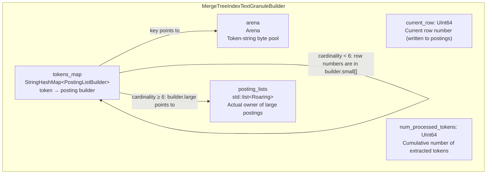

Responsibilities of each structure:

| Member | Type | Purpose |
|------|------|------|
| `current_row` | `UInt64` | Row number currently being indexed (0-based within the granule) |
| `num_processed_tokens` | `UInt64` | Cumulative token occurrence count (the same token in multiple rows increments it multiple times) |
| `tokens_map` | `StringHashMap<PostingListBuilder>` | Main inverted-index table: token → posting builder |
| `posting_lists` | `std::list<PostingList>` (that is, `list<Roaring>`) | Holds the Roaring object only when a token has at least 6 row numbers; `list` keeps pointers stable |
| `arena` | `Arena` | Stores copies of token strings; hashmap keys point here to avoid repeated allocation |

`PostingListBuilder` itself uses a **union optimization**:

```
PostingListBuilder (about 24 bytes)
├─ small_size < 6  →  small[6]: an on-stack UInt32 array holding row numbers
└─ small_size ≥ 6  →  large.postings → a Roaring object in posting_lists
                      large.context  → BulkContext (accelerates sequential insertion)
```

### 4.3 Example: How Memory Changes Step by Step

Using the preceding four rows with `tokenizer = 'array'`, `current_row` starts at 0.

#### Initial State

```
current_row = 0
tokens_map  = {}
posting_lists = []
arena = (empty)
num_processed_tokens = 0
```

#### Processing row0: `addDocument("api")`, Then `addDocument("web")`

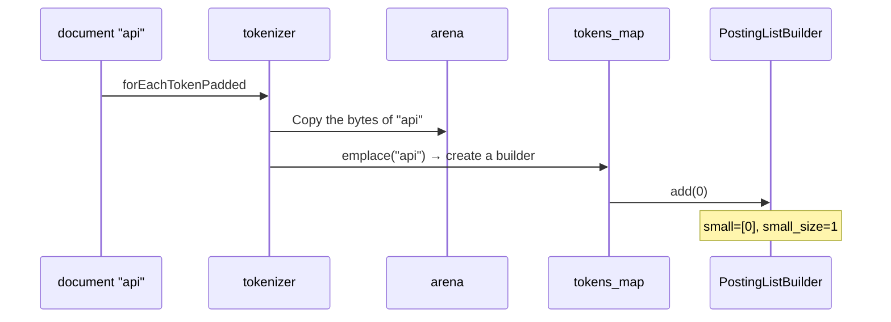

After processing both tokens in row0:

```
current_row = 0  (not incremented yet)
arena: ["api", "web"]
tokens_map:
  "api" → PostingListBuilder{ small=[0], size=1 }
  "web" → PostingListBuilder{ small=[0], size=1 }
posting_lists: []   ← no builder has been promoted to Roaring yet
num_processed_tokens = 2
```

The outer layer then calls `incrementCurrentRow()` → `current_row = 1`.

#### Processing row1: `addDocument("batch")` → Increment → row2: `addDocument("api")`

When `"api"` is encountered for the second time:

1. `tokens_map.emplace` finds that the key already exists (`inserted=false`).
2. It **does not copy another instance into the arena** (the existing key is reused).
3. It calls `add(2)` on the builder again → `small=[0, 2]`.

```
current_row = 2 (it becomes 3 after row2 is processed)
arena: ["api", "web", "batch"]
tokens_map:
  "api"    → small=[0, 2], size=2
  "web"    → small=[0],    size=1
  "batch"  → small=[1],    size=1
posting_lists: []
num_processed_tokens = 4
```

#### Processing row3: Final In-Memory State After `addDocument("canary")`

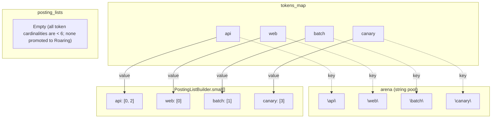

### 4.4 When `posting_lists` Is Written (small → Roaring)

Suppose `"api"` occurs at row numbers `0,1,2,3,4,5` in the same granule (`small_size` reaches `max_small_size=6` on the sixth insertion):

```cpp
// Key logic in PostingListBuilder::add
small[small_size++] = value;
if (small_size == max_small_size)  // == 6
{
    large.postings = &postings_holder.emplace_back();  // Create a Roaring object in posting_lists
    for (i = 0..5) large.postings->addBulk(..., small_copy[i]);
}
// All subsequent add() calls use large.postings->addBulk
```

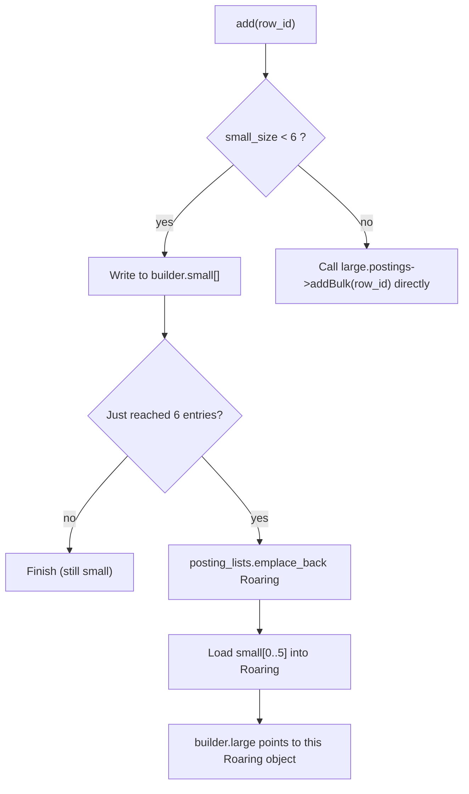

In-memory relationships after promotion:

```
tokens_map["api"].large.postings ──► a Roaring{0,1,2,3,4,5,...} object in posting_lists
tokens_map["web"].small = [0]     ──► remains inside the builder and occupies no posting_lists entry
```

### 4.5 Handoff to the Subsequent `build()`

`addDocument` only maintains an unordered hashmap. `build()` then:

1. Iterates over `tokens_map` and collects `(token_view, PostingListBuilder*)` pairs in `SortedTokensAndPostings`.
2. **Sorts them lexicographically by token**.
3. Transfers ownership of `tokens_map / posting_lists / arena` to `MergeTreeIndexGranuleTextWritable`.
4. Writes `.idx / .dct / .pst` only during subsequent serialization.

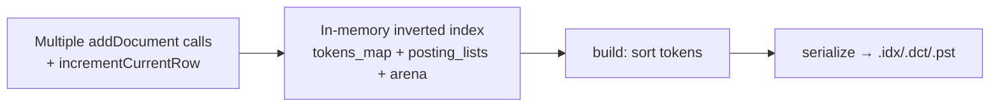

### 4.6 Summary

| Question | Answer |
|------|------|
| Does `addDocument` write to disk? | **No**; it only updates memory |
| Where are token strings stored? | **`arena`** |
| Where is the token → posting mapping? | **`tokens_map`** |
| Where are row numbers stored? | Infrequent token: `PostingListBuilder.small[]`; frequent token: a Roaring object in `posting_lists` |
| Where do row numbers come from? | The **`current_row`** member (advanced by `incrementCurrentRow`, not by `addDocument`) |
| What if the same token is written twice in one row? | `add()` finds that the value equals the previous value and **returns immediately** (deduplication) |

---

## 5. Serialization: What Is Written to Each of the Three Files

### Step 1: Sort Tokens + Split into Dictionary Blocks

1. Sort all tokens lexicographically (in the preceding example: `api, batch, canary, web`).
2. Split them into dictionary blocks according to `dictionary_block_size` (default: **512**).
3. The four tokens in this example produce **one dictionary block**.

### Step 2: Write `.dct` (Dictionary Blocks)

Binary layout of each dictionary block:

```
┌─ Dictionary Block ─────────────────────────────────────┐
│ tokens_format (VarUInt)          // 0=raw, 1=front-coded │
│ num_tokens (VarUInt)                                     │
│ tokens[] (ColumnString serialization)                    │
│ For each token:                                          │
│   header (VarUInt)     // Raw/Embedded/SingleBlock...  │
│   cardinality (VarUInt)                                  │
│   [offsets + row ranges] or [embedded posting]           │
└──────────────────────────────────────────────────────────┘
```

`tokens_format` is determined by the `dictionary_block_frontcoding_compression` parameter (default: `1` → FrontCoded):

```cpp
auto tokens_format = params.dictionary_block_frontcoding_compression
    ? TextIndexSerialization::TokensFormat::FrontCodedStrings  // 1
    : TextIndexSerialization::TokensFormat::RawStrings;         // 0

// serializeTokensImpl
writeVarUInt(static_cast<UInt64>(format), ostr);  // Write the format first
writeVarUInt(num_tokens_in_block, ostr);          // Then write the token count
switch (format) {
    case RawStrings:         serializeTokensRaw(...); break;
    case FrontCodedStrings:  serializeTokensFrontCoding(...); break;
}
```

### Step 2.1: Differences Between the Two Token Serialization Formats

| | `RawStrings` (0) | `FrontCodedStrings` (1, default) |
|--|------------------|-------------------------------|
| Parameter | `dictionary_block_frontcoding_compression = 0` | `= 1` |
| Approach | Write every token in full | Exploit common prefixes among **sorted** tokens and write only the suffix |
| Data written per token | `len` + all bytes | First token: `len` + all bytes; subsequent tokens: `lcp` + `suffix_len` + suffix bytes |
| Space | Uncompressed and larger | More compact when prefixes repeat frequently (for example, `host.ip` / `host.name`) |
| Reading | Read directly with `SerializationString` | Reconstruct using the previous token: `prev[0..lcp) + suffix` |
| Use case | Debugging or tokens with almost no common prefixes | Production default; tokens within a dictionary block are already sorted lexicographically |

#### RawStrings: Full Storage

```cpp
// serializeTokensRaw
for each token:
    writeVarUInt(token.size());
    write(token.data(), token.size());
```

Suppose the sorted tokens in a block are `apple`, `apply`, and `apricot`:

```
┌─ RawStrings ─────────────────────────────────────┐
│ len=5 "apple" │ len=5 "apply" │ len=7 "apricot" │
└──────────────────────────────────────────────────┘
Bytes written (schematic): 5 apple | 5 apply | 7 apricot
```

#### FrontCodedStrings: Prefix Encoding

```cpp
// serializeTokensFrontCoding
// First token: write it in full
writeVarUInt(first.size()); write(first);

// Subsequent tokens: write only the common-prefix length with the previous token + the remaining suffix
for each next token:
    lcp = commonPrefixLength(previous, current);
    writeVarUInt(lcp);
    writeVarUInt(current.size() - lcp);
    write(current.data() + lcp, current.size() - lcp);
```

For the same token set (compare the common prefix character by character and stop at the first difference):

```
apple  vs apply   : a-p-p-l | e≠y  → LCP=4 ("appl"), suffix = "y"
apply  vs apricot : a-p | p≠r     → LCP=2 ("ap"),   suffix = "ricot"
```

Note: the LCP is computed **against the previously reconstructed token**, not the first token in the block.
The third characters of `apply` and `apricot` are `p` and `r`, respectively, so their common prefix is `ap`, not `apr`.

```
┌─ FrontCodedStrings ──────────────────────────────────────────┐
│ [full] len=5 "apple"                                         │
│ [relative] lcp=4, suffix_len=1, "y"   → "appl" + "y" = apply │
│ [relative] lcp=2, suffix_len=5, "ricot" → "ap" + "ricot" = apricot │
└──────────────────────────────────────────────────────────────┘
```

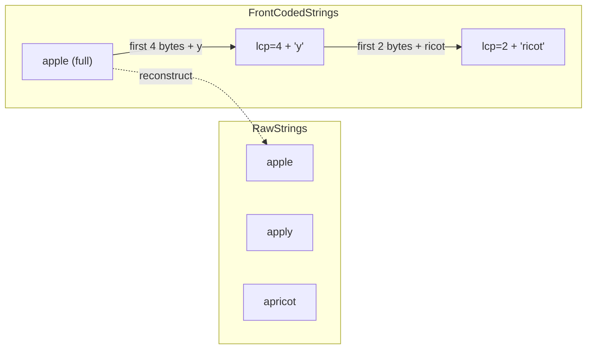

#### Why Front Coding Works

Tokens within a dictionary block are **already sorted lexicographically**, so adjacent tokens often share a prefix (for example, `api` / `app` or `host.ip` / `host.name`). Front coding stores only the differences, and a sequential scan reconstructs the block during reading. The sparse index still uses the **complete first token** of each block for binary-search positioning, so front coding does not affect it.

The corresponding read paths are `deserializeTokensRaw` and `deserializeTokensFrontCoding`: the latter copies the prefix of length `lcp` from the previous token and appends the suffix.

---

### Step 3: The `serializePostings` Flow and How It Affects `.dct` Writes

Each token is processed in three fixed steps inside `serializeTokensAndPostings`:

```cpp
// For each token in the dictionary block:
auto token_info = serializePostings(postings, postings_stream, ...);  // ① Decide + possibly write .pst
serializeTokenInfo(dictionary_stream, token_info);                    // ② Write metadata to .dct
if (token_info.header & EmbeddedPostings)
    PostingsSerialization::serialize(..., dictionary_stream);         // ③ Embedded only: write the body to .dct
```

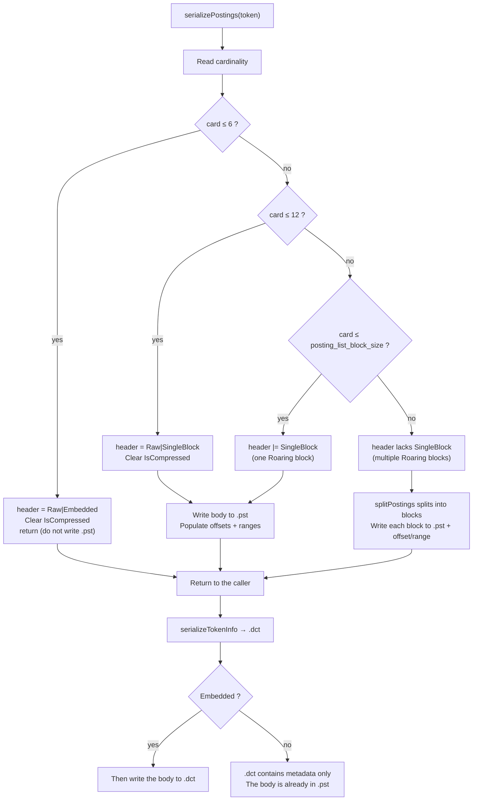

Threshold constants:

```cpp
static constexpr UInt64 MAX_CARDINALITY_FOR_EMBEDDED_POSTINGS = 6;
static constexpr UInt64 MAX_CARDINALITY_FOR_RAW_POSTINGS = 12;
// posting_list_block_size defaults to 1048576
```

`TokenPostingsInfo` fields:

| Field | Meaning |
|------|------|
| `header` | Flags bitmap (Raw / Embedded / SingleBlock / IsCompressed) |
| `cardinality` | Number of row numbers |
| `offsets[]` | Offset of each posting block in the **`.pst` file** (empty for Embedded postings) |
| `ranges[]` | `[min_row, max_row]` for each block (empty for Embedded postings) |
| `embedded_postings` | Used only on the read path; on the write path, an embedded body is appended directly to `.dct` |

What `serializeTokenInfo` writes to `.dct` depends on the header:

```cpp
writeVarUInt(header);
writeVarUInt(cardinality);
if (EmbeddedPostings) return;           // Do not write offset/range; the body immediately follows
if (!(SingleBlock)) writeVarUInt(num_blocks);
for each block:
    writeVarUInt(offset); writeVarUInt(range.begin); writeVarUInt(range.end);
```

---

#### Scenario A: Embedded (card ≤ 6)—Body Goes to `.dct`; Nothing Is Written to `.pst`

**Example**: token `api`, row numbers `{0, 2}`, card=2.

`serializePostings`:

1. Set `header = RawPostings | EmbeddedPostings` and clear `IsCompressed`.
2. **Return immediately** without touching `.pst`; `offsets/ranges` remain empty.

Then:

1. `serializeTokenInfo` → write only `header` + `cardinality=2` to `.dct`.
2. Because this is `EmbeddedPostings`, write the body to **`.dct`** as two VarUInt values, `0` and `2`.

```
.dct segment for this token:
┌─────────┬──────┬─────┬─────┐
│ header  │ card │  0  │  2  │
│ Raw|Emb │  2   │row  │row  │
└─────────┴──────┴─────┴─────┘
.pst: no data for this token
```

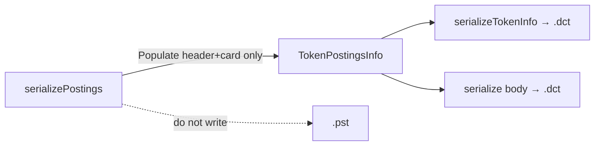

---

#### Scenario B: Raw + SingleBlock (7 ≤ card ≤ 12)—Body Goes to `.pst`; `.dct` Stores Only a Pointer

**Example**: token `batch`, row numbers `{1,3,5,7,9,11,13,15}`, card=8.

`serializePostings`:

1. Set `header = RawPostings | SingleBlock` and clear `IsCompressed`.
2. Take the `SingleBlock` branch:
   - `offsets = [current .pst write position]` (for example, `1024`)
   - `ranges = [{1, 15}]`
   - Write the body to **`.pst`** as eight VarUInt row numbers.

Then `serializeTokenInfo` → `.dct`:

```
header | card=8 | offset=1024 | min=1 | max=15
(SingleBlock → do not write num_blocks)
```

```
.dct:  [header Raw|Single][8][1024][1][15]     ← metadata only
.pst:  ... | VarUInt(1)(3)(5)(7)(9)(11)(13)(15) | ...
              ↑ offset=1024
```

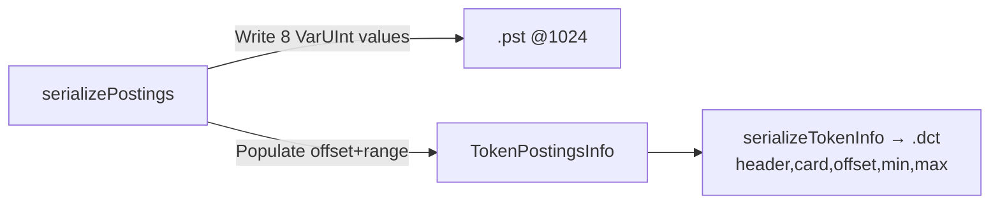

---

#### Scenario C: One Roaring Block (12 < card ≤ posting_list_block_size)—`.pst` Stores Roaring

**Example**: token `web` occurs in 100 rows, card=100, and `posting_list_block_size=1MB`. The default codec is `none` (no `IsCompressed`).

`serializePostings`:

1. card>12 and ≤ block_size → `header |= SingleBlock` (no Raw).
2. `offsets=[pst_pos]`, `ranges=[{min,max}]`
3. Write the body to `.pst`: `VarUInt(nbytes)` + portable Roaring bytes.

`.dct` still contains only metadata (the same structure as Scenario B, but without Raw in the header):

```
.dct:  [header SingleBlock][100][offset][min][max]
.pst:  [nbytes][Roaring bytes...]
```

On read: seek into `.pst` by offset and read Roaring, not a VarUInt list.

---

#### Scenario D: Multiple Roaring Blocks (card > posting_list_block_size)—Split into Blocks and Write `.pst`

For illustration, suppose `posting_list_block_size = 4` (the production default is 1 MB) and token `svc` has these row numbers:

```
{0,1,2,3,  10,11,12,13,  20,21}   → card=10, but split into multiple blocks by Roaring container/threshold
```

(The actual split occurs when cumulative cardinality across internal Roaring containers reaches `posting_list_block_size`; the small threshold here only illustrates the multi-block layout.)

`serializePostings` takes the `else` branch:

```cpp
auto blocks = splitPostings(roaring, posting_list_block_size);
for each block:
    offsets.emplace_back(pst.count());
    ranges.emplace_back(min, max);
    serialize(block → .pst);   // Each block: nbytes + Roaring
```

Suppose it is split into three blocks:

| block | rows (schematic) | .pst offset | range |
|-------|--------------|-------------|-------|
| 0 | {0,1,2,3} | 2000 | [0,3] |
| 1 | {10,11,12,13} | 2100 | [10,13] |
| 2 | {20,21} | 2200 | [20,21] |

The `header` **does not contain** `SingleBlock`, so `serializeTokenInfo` also writes `num_blocks`:

```
.dct:
  header (without SingleBlock)
  card=10
  num_blocks=3
  offset=2000, min=0,  max=3
  offset=2100, min=10, max=13
  offset=2200, min=20, max=21

.pst:
  @2000: roaring_block0
  @2100: roaring_block1
  @2200: roaring_block2
```

When querying a row range, `ranges` lets the reader load only intersecting blocks (`TokenPostingsInfo::getBlocksToRead`) instead of the entire posting.

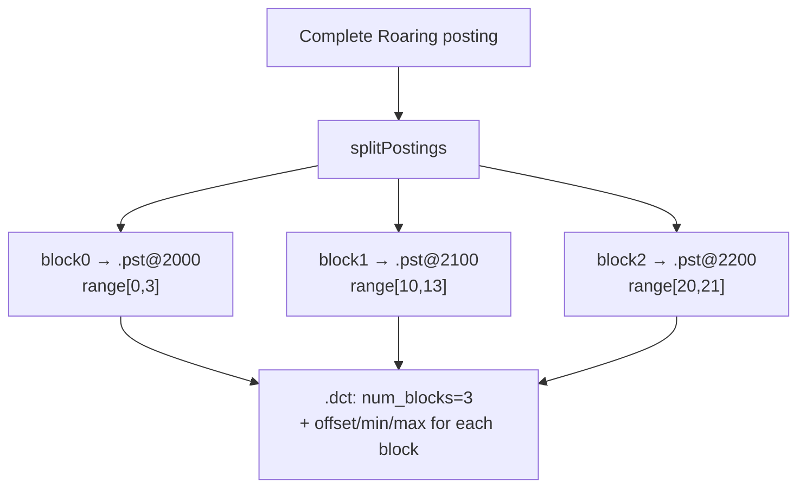

---

#### Scenario E: `IsCompressed` (`posting_list_codec ≠ none`)

If the table specifies `posting_list_codec = 'bitpacking'` (or another codec) and the posting is **not** a small Embedded/Raw posting:

1. `IsCompressed` may be set initially.
2. For card≤6, `IsCompressed` is **forcibly cleared**, and the posting is still embedded (compression is used only for large postings).
3. A large posting goes through `posting_list_codec->encode(...)`; the codec splits it according to `posting_list_block_size` and populates `offsets/ranges`.
4. On the `.dct` side, `serializeTokenInfo` still writes the header (including `IsCompressed`) + card + offset/range; the body is in `.pst`.

```cpp
// Small postings are forcibly left uncompressed:
if (card <= 6) {
    header |= Raw | Embedded;
    header &= ~IsCompressed;
    return;
}
```

---

#### Comparison of the Four Scenarios (Default codec=`none`)

| Scenario | card | header | Body written to | Contents written to `.dct` |
|------|------|--------|-----------|-----------------|
| A Embedded | ≤6 | Raw\|Embedded | **`.dct`** (immediately after metadata) | header + card + **body** |
| B Raw single block | 7–12 | Raw\|SingleBlock | **`.pst`** (VarUInt list) | header + card + offset + min + max |
| C Roaring single block | 13–block_size | SingleBlock | **No body in `.dct`**; `.pst` contains Roaring | Same as B (header without Raw) |
| D Roaring multiple blocks | > block_size | (no SingleBlock) | **Multiple Roaring segments in `.pst`** | header + card + **num_blocks** + offset/min/max for each block |

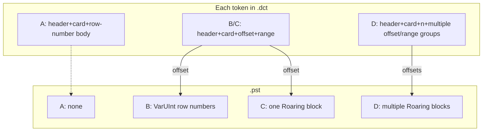

---

#### Relationship to Call Order (Why Embedded Uses Two Steps)

```cpp
auto token_info = serializePostings(...);   // Embedded: decide only; do not write the body
serializeTokenInfo(dct, token_info);        // Write header/card first
if (Embedded)
    serialize(postings → dct);              // Then write the body, keeping the .dct layout contiguous
```

For non-Embedded postings, the body has already been written to `.pst` inside `serializePostings`; `serializeTokenInfo` records only where to read it in `.dct`.

---

### Step 4: Write `.idx` (Sparse Index)

```cpp
void TextIndexSerialization::serializeSparseIndex(...)
{
    writeVarUInt(version, ostr);           // Version number
    writeVarUInt(num_blocks, ostr);        // Number of dictionary blocks
    serialize tokens[];                    // First token of each block
    serialize offsets_in_file[];           // Corresponding .dct file offsets
}
```

**Contents of `.idx` in this example**:

```
version = 0
num_blocks = 1
tokens = ["api"]          ← first token of the first block
offsets = [0]             ← this block's offset in .dct
```

When querying `has(tags, 'canary')`:

1. Use binary search in the sparse index to find the block containing `api` (`canary` ≥ `api` and < the first token of the next block).
2. Read the entire dictionary block at the offset.
3. Find `canary` within the block → read posting `{3}`.
4. Knowing that row 3 within the granule matches enables pruning or Direct Read.

---

## 6. Complete File-Layout Diagram

### Small-Posting Scenario (This Example: All Embedded in .dct)

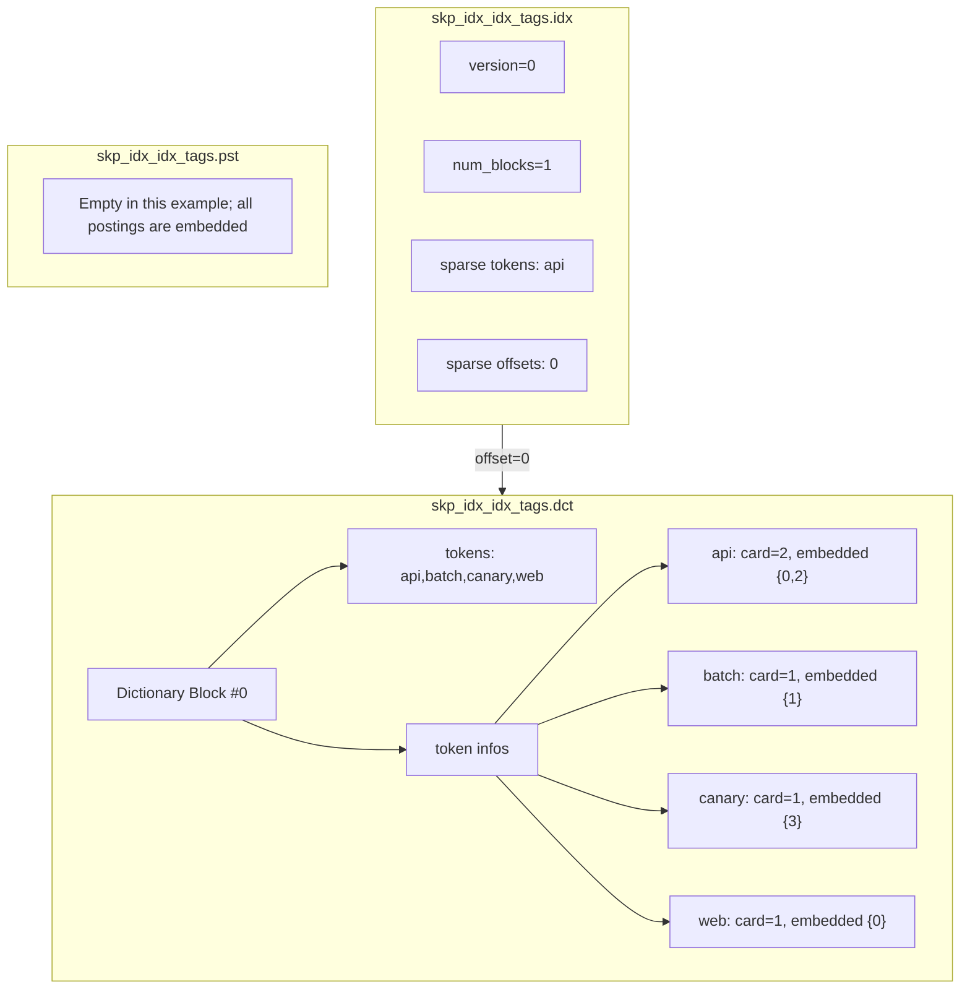

### Large-Posting Scenario (for Example, `api` Occurs 5,000 Times)

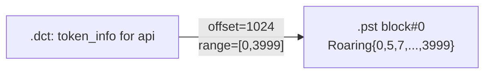

When a posting exceeds `posting_list_block_size` (a 1 MB row-number range by default), it is split into multiple blocks. `.dct` stores the offset + min/max row range for each block.

---

## 7. Configurable Parameters

| Parameter | Default | Effect |
|------|--------|------|
| `tokenizer` | Required | How to tokenize: `array` / `splitByNonAlpha` / `ngrams` / `sparseGrams` / `splitByString` |
| `preprocessor` | None | Transform the column before writing (for example, `lower(col)`) without changing the array dimensions |
| `dictionary_block_size` | 512 | Maximum number of tokens per .dct block |
| `dictionary_block_frontcoding_compression` | 1 | Compress tokens with front coding (shared prefixes) |
| `posting_list_block_size` | 1048576 (1MB) | Split large postings into blocks by row-number range |
| `posting_list_codec` | `none` | Additional posting-compression codec |
| `GRANULARITY N` | **No effect on text** (forced to `100000000`) | User-specified N is ignored; one inverted index covers the entire part |
| Table `index_granularity` | 8192 (default) | Determines PK-mark size; queries prune by intersecting each mark with postings |

Table-creation example:

```sql
CREATE TABLE t (
    message String,
    INDEX idx_msg message TYPE text(
        tokenizer = 'splitByNonAlpha',
        dictionary_block_size = 512,
        posting_list_block_size = 1048576,
        preprocessor = lower(message)
    )  -- GRANULARITY may be specified, but for text it is forced to 100000000
) ENGINE = MergeTree ORDER BY tuple();
```

---

## 8. Comparison with minmax / bloom_filter

| | minmax / bloom_filter | text index |
|--|----------------------|------------|
| Granularity | Per-column min/max or probabilistic structure | **Inverted posting list for each token** |
| Stored data | Aggregate statistics | Token dictionary + sets of row numbers |
| Number of files | One `.idx` | **Three**: `.idx` + `.dct` + `.pst` |
| merge | Usually rebuilt | **Mergeable** (`MergeTextIndexesTask`) |
| Query | Range/existence filtering | Token matching with `has()` / `hasAnyTokens()` and similar functions |
| Direct Read | Not supported | Supported (`__text_index_*` virtual columns) |

---

## 9. Validation SQL

```sql
-- Create table + insert data
CREATE DATABASE IF NOT EXISTS text_index_demo;
USE text_index_demo;

DROP TABLE IF EXISTS demo;

CREATE TABLE demo (
    id UInt64,
    tags Array(String),
    INDEX idx_tags tags TYPE text(tokenizer = 'array')
) ENGINE = MergeTree
ORDER BY id
SETTINGS index_granularity = 4;

INSERT INTO demo VALUES
(0, ['api','web']),
(1, ['batch']),
(2, ['api']),
(3, ['canary']);

OPTIMIZE TABLE demo FINAL;

-- Inspect index-column storage in the part
SELECT
    name,
    column,
    type,
    data_compressed_bytes,
    data_uncompressed_bytes
FROM system.parts_columns
WHERE database = currentDatabase()
  AND table = 'demo'
  AND active
  AND column LIKE 'skp_idx%'
ORDER BY column;

-- Verify index pruning
EXPLAIN indexes = 1
SELECT count() FROM demo WHERE has(tags, 'api')
SETTINGS use_skip_indexes_on_data_read = 0;
```

---

## 11. How a Query Uses the Index to Locate a Granule

Using `WHERE has(tags, 'api')` as an example, this section traces the complete path from `.idx → .dct → .pst` to **keeping/skipping a PK granule (mark)**.

### 11.1 Prerequisite: Text-Index Granule vs PK Granule

| Concept | Meaning |
|------|------|
| PK granule / mark | A data block defined by the table's `index_granularity` (for example, one mark per four rows) |
| Text index granule | **One inverted index for the entire part**. `INDEX ... GRANULARITY N` has **no effect** on text indexes and is forced to `100000000` during parsing (`DEFAULT_TEXT_INDEX_GRANULARITY`) |
| Posting row number | A row number within the text granule; because it covers the whole part, this is equivalent to an **absolute row number within the part** |

```cpp
// Parsers/ASTIndexDeclaration.cpp
/// Text index is always built for the whole part and granularity is ignored.
if (type && type->name == "text")
    return ASTIndexDeclaration::DEFAULT_TEXT_INDEX_GRANULARITY;  // 100'000'000
```

Special handling of text indexes during planning-time pruning (`use_skip_indexes_on_data_read=0`) in `MergeTreeDataSelectExecutor`:

1. Deserialize the text-index granule **only once** (`reader.read(0, ...)`) because the entire part has only one.
2. For each **PK mark**, set `current_range = [the mark's first row, last row]`.
3. Intersect the posting with `current_range` to decide whether to keep the mark.

Therefore, the following example uses `index_granularity = 4` and eight rows of data → **two PK marks** sharing **the same** text inverted index. Pruning occurs at PK-mark granularity, not text `GRANULARITY`.

### 11.2 Example Data (Two PK Granules)

```sql
CREATE TABLE demo (
    id UInt64,
    tags Array(String),
    INDEX idx_tags tags TYPE text(tokenizer = 'array')
    -- Even if GRANULARITY 1 / 2 is specified, the effective value remains 100000000 (one per entire part)
) ENGINE = MergeTree
ORDER BY id
SETTINGS index_granularity = 4;

INSERT INTO demo VALUES
-- PK mark 0, rows 0..3
(0, ['api','web']),
(1, ['batch']),
(2, ['api']),
(3, ['canary']),
-- PK mark 1, rows 4..7
(4, ['web']),
(5, ['api','batch']),
(6, ['canary']),
(7, ['web']);
```

| PK mark | Row-number range | Rows containing `api` |
|---------|----------|---------------|
| mark 0 | [0, 3] | 0, 2 |
| mark 1 | [4, 7] | 5 |

One text-index granule covers rows 0..7. Its inverted index (simplified, assuming few tokens and all Embedded postings) is:

| token | posting (row numbers) | card |
|-------|-----------------|------|
| `api` | {0, 2, 5} | 3 |
| `batch` | {1, 5} | 2 |
| `canary` | {3, 6} | 2 |
| `web` | {0, 4, 7} | 3 |

`.idx` (assuming `dictionary_block_size` is large enough that there is only one dictionary block):

```
sparse: first_token="api", offset_in_dct=0
```

### 11.3 Overall Flow

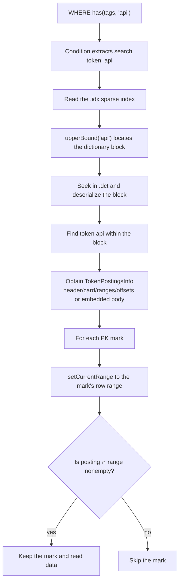

### 11.4 Step-by-step

#### Step 1: Parse the Query → Search Tokens

`MergeTreeIndexConditionText` encodes `has(tags, 'api')` as RPN and obtains the search-token set `{"api"}`.

#### Step 2: Read `.idx` (Sparse Index)

```cpp
// MergeTreeIndexGranuleText::readSparseIndex
sparse_index = deserializeSparseIndex(.idx);
// tokens = ["api"], offsets_in_file = [0]
```

The sparse index is small and is usually read in full (possibly through the header cache).

#### Step 3: Use the Sparse Index to Locate the `.dct` Block

```cpp
// analyzeDictionary
idx = sparse_index->upperBound("api");  // Find the first position > "api"
if (idx != 0) --idx;                   // Step back to the candidate block
offset = sparse_index->getOffsetInFile(idx);
stream.seekToMark({offset, 0});
block = deserializeDictionaryBlock(.dct);
```

This example has only one block, so `idx=0`; seek to offset 0 in `.dct` and read all tokens together with their respective `TokenPostingsInfo`.

If there are multiple dictionary blocks (for example, with first tokens `api` / `mmm` / `xxx`):

```
Search for "canary":
  upperBound("canary") → falls between first="api" and first="mmm"
  → read block0 (api..) and find canary within the block
```

#### Step 4: Retrieve `api`'s TokenPostingsInfo

Search for the token within the dictionary block:

- Found → store it as `remaining_tokens["api"] = token_info`.
- Not found and the operation is `hasAllTokens` → immediately determine that the entire granule does not match.

In this Embedded example, `token_info` has `header=Raw|Embedded`, `card=3`, and body `{0,2,5}`. Deserialization also populates:

```
ranges = [{0, 5}]    // min..max of posting
offsets = [0]        // Embedded placeholder; the actual body is already in info
```

For a large posting (non-Embedded), `.dct` contains only `offset → .pst` + `ranges`; when needed:

```cpp
stream.seekToMark({token_info.offsets[block_idx], 0});  // Jump into .pst
postings = deserialize(.pst);
```

#### Step 5: Prune with Postings by PK Mark

```cpp
// MergeTreeDataSelectExecutor (text-index branch)
for (mark = 0; mark < num_marks; ++mark) {
    row_begin = getMarkStartingRow(mark);
    row_end   = getMarkStartingRow(mark + 1);
    granule.setCurrentRange({row_begin, row_end - 1});
    if (condition.mayBeTrueOnGranule(granule))
        keep the mark;
}
```

Core `hasAnyQueryTokens` logic:

```cpp
// 1) token is not in remaining_tokens → this mark does not contain the token
// 2) token_info.ranges does not intersect current_range → skip (coarse filter)
// 3) If the posting is loaded (Embedded / SingleBlock rare):
//      intersection = postings ∩ [row_begin, row_end]
//      Nonempty → keep
```

### 11.5 Walking Through the Two Marks

**Query**: `has(tags, 'api')`, posting = `{0, 2, 5}`, `ranges ≈ [0, 5]`

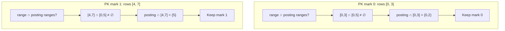

Both marks are kept (both contain `api`).

---

**Comparison query**: `has(tags, 'batch')`, posting = `{1, 5}`

| PK mark | current_range | Coarse filtering by ranges | posting ∩ range | Result |
|---------|---------------|-------------|-----------------|------|
| mark 0 | [0, 3] | [0,3]∩[1,5]≠∅ | {1} | **Keep** |
| mark 1 | [4, 7] | [4,7]∩[1,5]≠∅ | {5} | **Keep** |

---

**Comparison query**: `has(tags, 'canary')`, posting = `{3, 6}`

| PK mark | current_range | posting ∩ range | Result |
|---------|---------------|-----------------|------|
| mark 0 | [0, 3] | {3} | **Keep** |
| mark 1 | [4, 7] | {6} | **Keep** |

---

**Another example that matches only mark 1**: suppose the data is changed so that only row 5 contains `api`, with posting = `{5}` and `ranges=[5,5]`:

| PK mark | current_range | Coarse filtering by ranges | posting ∩ range | Result |
|---------|---------------|-------------|-----------------|------|
| mark 0 | [0, 3] | [0,3]∩[5,5]=∅ | — | **Skip** (the coarse filter is sufficient) |
| mark 1 | [4, 7] | Intersects | {5} | **Keep** |

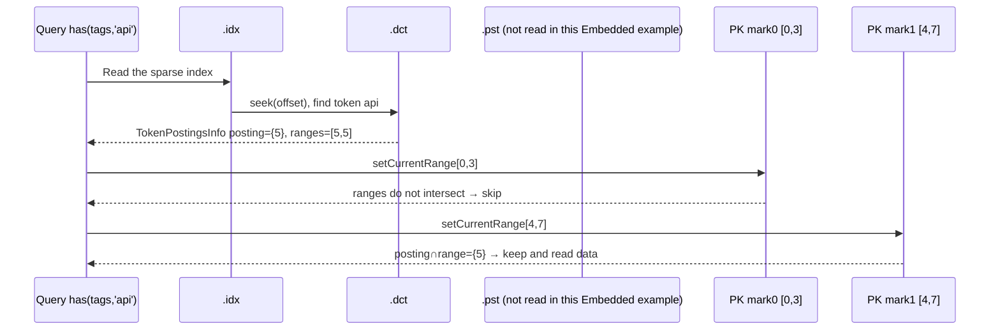

### 11.6 Positioning with Multiple Dictionary Blocks (Additional Detail)

Suppose there are many distinct tokens, `dictionary_block_size=2`, and the sorted tokens are `api, batch, canary, web` → two dct blocks:

```
.idx:
  [0] first="api",    offset→dct_block0   // tokens: api, batch
  [1] first="canary", offset→dct_block1   // tokens: canary, web
```

Searching for `web`:

1. `upperBound("web")` → points to block1 or the position after block1.
2. `--idx` → block1
3. Read only **dct_block1**, not block0.
4. Find `web` in block1 → then intersect the posting with each PK mark as before.

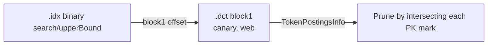

### 11.7 Read-Time Pruning vs Planning-Time Pruning

| Mode | Entry Point | Behavior |
|------|------|------|
| `use_skip_indexes_on_data_read=0` | `MergeTreeDataSelectExecutor` | Calls `mayBeTrueOnGranule` for every mark at planning time to reduce MarkRanges |
| `=1` (default) | `MergeTreeReaderTextIndex::canSkipMark` | Checks while reading data; can populate `__text_index_*` in conjunction with Direct Read |

Both use the same index information: `.idx → .dct → (optional) .pst`, followed by intersection with the mark's row range.

### 11.8 Summary

| Step | File/Structure Used | Purpose |
|------|-----------------|------|
| 1 | Query AST / Condition | Obtain search tokens |
| 2 | `.idx` | Locate the dictionary block using its first token |
| 3 | `.dct` | Retrieve the token's `TokenPostingsInfo` (small postings include the body directly) |
| 4 | `.pst` (if non-Embedded) | Seek by `offsets[i]` and read Roaring/Raw row numbers |
| 5 | PK mark's `[row_begin, row_end]` | Intersect with posting / ranges → keep or skip the granule |

**In one sentence**: `.idx` locates the dictionary block, `.dct` locates the token metadata (and small posting), and `.pst` provides the large posting; finally, **the row-number set ∩ each PK mark's row range** determines which granules to read.

---

## 12. Key Source Files

| File | Responsibility |
|------|------|
| `Storages/MergeTree/MergeTreeIndexText.h` | Format definitions and Granule/Aggregator/Builder |
| `Storages/MergeTree/MergeTreeIndexText.cpp` | Serialization/deserialization and tokenization aggregation |
| `Storages/MergeTree/MergeTreeDataPartWriterOnDisk.cpp` | Triggers index calculation during part writes |
| `Storages/MergeTree/MergeTreeReaderTextIndex.cpp` | Reads the index during queries; Direct Read |
| `Storages/MergeTree/TextIndexUtils.cpp` | Merges text indexes during merges |
| `Storages/MergeTree/MergeTreeIndicesSerialization.h` | Multi-substream abstraction |
| `Processors/QueryPlan/Optimizations/optimizeDirectReadFromTextIndex.cpp` | Direct Read optimization |

---

## 13. Summary in One Sentence

When writing a text index, ClickHouse tokenizes the rows in each skip-index granule, builds an inverted `token → set of row numbers` mapping, and splits it into three storage layers:

- **`.idx`**: locates dictionary blocks (sparse index)
- **`.dct`**: token dictionary + metadata/embedded data for small postings
- **`.pst`**: Roaring Bitmaps for large postings

At query time: `.idx` locates the dictionary block → `.dct` retrieves the token metadata → optionally, `.pst` reads the large posting → intersection with each PK mark's row range skips irrelevant granules. In Direct Read mode, matching rows can be returned directly from the index.
