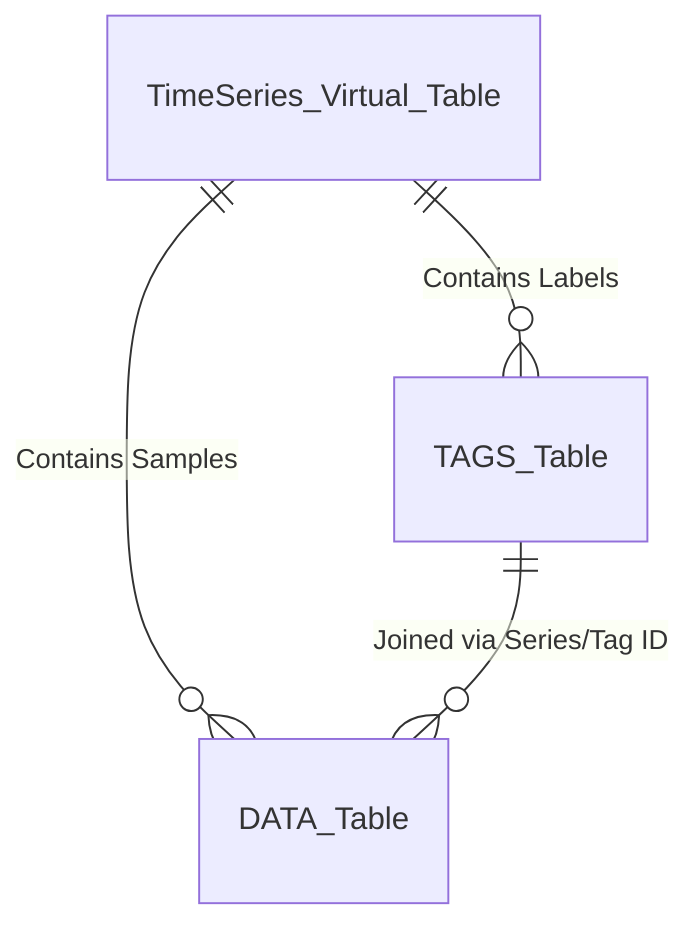
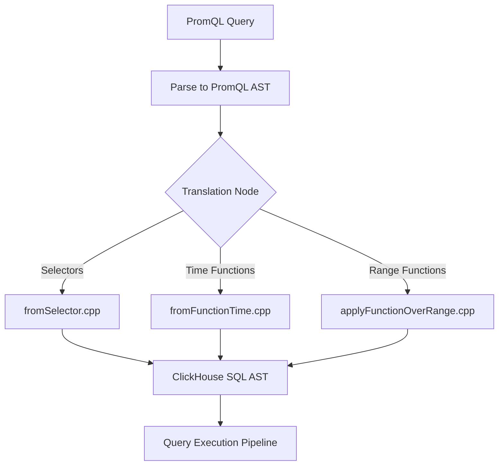

# ClickHouse TimeSeries Engine & PromQL-to-SQL Translation Architecture

This guide provides a comprehensive deep-dive into ClickHouse's native `TimeSeries` engine and its sophisticated PromQL-to-SQL translation layer.

## 1. ENGINE = TimeSeries Data Model

The `TimeSeries` engine in ClickHouse abstracts the complexity of storing high-cardinality metric data by automatically orchestrating a multi-table architecture. 

### Multi-Table Mapping
When you define a table with `ENGINE = TimeSeries`, ClickHouse internally maps it to a dual or triple table structure:
1. **DATA Table**: Stores the actual time-series samples (timestamps and float values).
2. **TAGS Table**: Stores the unique combinations of labels/tags associated with each metric stream.
3. **METRICS Table (Optional/Implicit)**: Groups tags into metric families.

### Column Normalization & Inner Columns
The AST rewriting phase intercepts the table creation. Inside `src/Storages/TimeSeries/normalizeTimeSeriesDefinition.cpp`, the engine normalizes the user's schema definition to inject mandatory `SAMPLES INNER COLUMNS` (typically `timestamp` and `value`). It dynamically provisions the underlying `MergeTree` tables for data and tags, ensuring optimized sorting keys.

## 2. PrometheusQueryToSQL Translator

ClickHouse features a native Prometheus AST to SQL compiler, transforming PromQL directly into optimized ClickHouse SQL.

### AST Translation Pipeline
The translation pipeline is composed of several specialized visitors located in `src/Storages/TimeSeries/`:
* `fromSelector.cpp`: Translates PromQL vector selectors (e.g., `metric{job="api"}`) into `JOIN`s between the TAGS and DATA tables.
* `fromFunctionTime.cpp` / `applyDateTimeFunction.cpp`: Handles time-based functions. Notably, `makeTimeQueryPieceNative` ensures that native timestamp domains are preserved without unnecessary casting, maximizing index usage.
* `applyFunctionOverRange.cpp`: Maps PromQL range vector functions (e.g., `rate()`, `sum_over_time()`) to ClickHouse window functions or array manipulations.
* `applyFunctionVector.cpp` & `applyFunctionScalar.cpp`: Handle vector matching and scalar math.

## 3. Sliding Window Aggregations

PromQL relies heavily on sliding window aggregations over time series. ClickHouse implements state-of-the-art algorithms in `src/AggregateFunctions/TimeSeries/` to make these highly efficient.

### Welford's Algorithm and Chan's Parallel Merge
For variance and standard deviation (e.g., in `AggregateFunctionTimeseriesVarianceOverTime.h`), computing naive sum-of-squares ($E[x^2] - E[x]^2$) leads to catastrophic cancellation due to floating-point precision loss.

Instead, ClickHouse uses **Welford's algorithm** to compute the mean and sum of squared differences from the mean ($M_2$) incrementally:
$$ M_{2,n} = M_{2,n-1} + (x_n - \bar{x}_{n-1})(x_n - \bar{x}_n) $$

To support parallel execution and state merging across ClickHouse nodes, **Chan's algorithm** is used to combine two states:
$$ M_{2,A\cup B} = M_{2,A} + M_{2,B} + \frac{n_A n_B}{n_A + n_B} (\bar{x}_A - \bar{x}_B)^2 $$

### 2-Stack Queue for Sliding Windows
To efficiently compute sliding aggregates like minimum, maximum, or variance over a moving window, ClickHouse implements a **2-stack queue** approach. This allows $O(1)$ amortized time complexity for enqueue and dequeue operations while maintaining the aggregation state, drastically outperforming naive recalculation over the window.

## 4. Prometheus Staleness Mechanics

Prometheus handles disappearing metrics via staleness markers. ClickHouse accurately replicates this behavior.

### Ingestion and the Stale Marker
During ingestion via the RemoteWrite protocol (`src/Storages/TimeSeries/PrometheusRemoteWriteProtocol.cpp`), when Prometheus detects a target has gone away or a metric is no longer exposed, it sends a specific staleness marker.

In ClickHouse, this is mapped to a special NaN payload bit pattern: `0x7ff0000000000002`. During query time, an `is_stale_marker` flag or function is used to identify these values.

### Query Filtering
* **Range Selectors**: The SQL translator automatically injects `WHERE NOT is_stale_marker(value)` to prevent staleness markers from polluting range aggregations like `rate()`.
* **Instant Selectors**: For instant vector evaluation, the staleness marker is used to implement the lookback cutoff. If the most recent sample within the 5-minute lookback window is a stale marker, the series is dropped from the result rather than returning the stale value or an older sample.